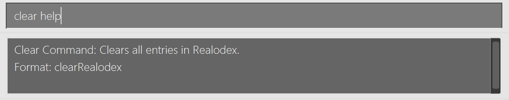

# Realodex User Guide
## Welcome to Realodex!
**Realodex** is your ultimate client management tool tailored specifically for the dynamic needs of real estate professionals. Designed to streamline the day-to-day operations of realtors, brokers, and real estate agencies, Realodex offers seamless functionality to ***add***, ***edit***, ***search***, and ***delete*** client information effortlessly.

- **Add**: Quickly input new client data, from contact details to property preferences, building a rich, actionable database.
- **Edit**: Easily update client information to keep profiles accurate and comprehensive, reflecting the latest changes in their needs or status.
- **Search**: Instantly locate client profiles using robust filters, enabling swift responses and tailored service.
- **Delete**: Safely remove outdated information, ensuring your database is current and compliant.

    

## Why Choose Realodex?
With our **intuitive interface** and **advanced features**, real estate users can manage their client database with unprecedented ease, enhancing their productivity and enabling them to focus on what they do best: closing deals and building lasting relationships.

Whether you're a seasoned real estate veteran or a rising star in the industry, Realodex is your partner in achieving operational excellence and superior client service.

**New to Realodex?** Rest assured—this user guide delivers thorough documentation on utilizing Realodex’s current features, provides answers to frequently asked questions, and sheds light on future enhancements. Kickstart your journey by delving into the [Quick Start](#quick-start
) section, crafted to guide you through the functionalities that will elevate your real estate endeavours.

<!-- * Table of Contents -->
<page-nav-print />

--------------------------------------------------------------------------------------------------------------------
## Quick start

1. Ensure you have Java `11` or above installed in your computer.

1. Download the latest `realodex.jar` from [here](https://github.com/AY2324S2-CS2103T-W10-1/tp/releases).

1. Copy the file to the folder you want to use as the _home folder_ for your Realodex.

1. Open a command terminal, `cd` into the folder you put the jar file in, and use the `java -jar realodex.jar`
command to run the application. 
   A GUI similar to the below should appear in a few seconds. The app should contain some sample entries. 
   

1. Some example commands you can try:

   * `add n/John Doe p/98765432 i/20000 e/johnd@example.com a/311, Clementi Ave 2, #02-25 f/4 h/HDB t/buyer r/Owes money.`
   Adds a contact named `John Doe` to Realodex.

   * `delete n/john doe` : Deletes the client with name `John Doe` from Realodex.

1. Refer to the [Features](#features) below for details of each command.
----
## Using this Guide
Our goal is to empower you with the knowledge and confidence to unleash the full potential of Realodex. 

We have equipped Realodex with the following features.
- **Effortless Navigation**: Use the table of contents for seamless navigation between sections.
- **Quick Start for New Users**: New to Realodex? Get started with our Quick Start Guide as we handhold you through the process of setting up Realodex.
- **Features**: Learn more about Realodex's features and how to use them with our Features section.
- **Tutorial**: Get a step-by-step walkthrough of Realodex's features with our Tutorial.
  <box type="info">Look out for these boxes for things to note when using Realodex</box>
  <box type="tip">Look out for these boxes for tips and tricks on how to best use Realodex</box>
  <box type="warning">These boxes are for more context and warnings</box>
  <box type="wrong">These boxes are for errors and failure messages</box>

## Glossary

| Abbreviation/Nomenclature      | Meaning                                                                                                                                                                                                  |
|--------------------------------|----------------------------------------------------------------------------------------------------------------------------------------------------------------------------------------------------------|
| GUI (Graphical User Interface) | It is the digital interface which you interact with when using Realodex!                                                                                                                                 |
| GUI Components                 | A specific component of the GUI. For more information on specific GUI components, refer to this section.                                                                                                 |
| CLI (Command Line Interface)   | A text-based user interface to interact with the application.                                                                                                                                            |
| Command                        | An input from you that tells Realodex to execute an action. You can refer to the command summary [here](#command-summary)!                                                                               |
| Prefix                         | Prefixes are like fields in a form you are required to fill up. They are information needed to be passes together with the command so that it can be executed. View our Prefix Summary for more details! |
| Case-Sensitive                 | The casing of the alphabetic characters matters (e.g. “ReAlOdEx” is different from “realodex”                                                                                                            |
| Case-Insensitive               | The casing of the alphabetic characters does not matter (e.g. “ReAlOdEx” is taken to be same as “realodex”                                                                                               |

---

--------------------------------------------------------------------------------------------------------------------

## Features

<box type="info" seamless>

**Notes about the command format:** 

* Commands are generally in the format `COMMANDWORD PREFIX_ONE/UPPER_CASE PREFIX_TWO/UPPER_CASE ....`
* `COMMANDWORD` refers to the various commands user can input.  Examples include `add`, `delete`, `filter`. A summary of all commands and their usages can be found in the [Commands Summary](#command-summary) table.

* `COMMANDWORD` is case-insensitive, i.e.`add` and `ADD` both indicate the command word for `add`.
* `PREFIX/` refers to the prefix tag associated with each user-written input.  
   e.g. in `add n/NAME r/REMARK`, `NAME` is the name parameter and `REMARK` is the remark parameter.
* `PREFIX` is case-insensitive, i.e.`N/` and `n/` are the same and are used to indicate a `NAME` input.
* `PREFIX` must be preceded by a whitespace character.
   e.g. `a/6 College Avenue Westr/Has a dog` will only recognise the `a/` prefix as the `r/` prefix is preceded by `t` which is not a whitespace character.
* Words in `UPPER_CASE` are the parameters to be supplied by the user. 
  e.g. in `add n/NAME ....`, `NAME` is a parameter which can be used as `add n/John Doe ....`.
    For more details on the parameters, do refer to the [Field Constraints](#field-constraints).

* Parameters enclosed in `[]` are optional to input. e.g. `[r/REMARK]` indicates an optional input field for that command.

* You may input the parameters in any order (e.g. if the command specifies `n/NAME a/ADDRESS`, `a/ADDRESS n/NAME` is also acceptable).

* If you are using a PDF version of this document, be careful when copying and pasting commands that span multiple lines as space characters surrounding line-breaks may be omitted when copied over to the application.

</box>

### Adding a client: `add`

Adds a client to Realodex.

<u>Format</u>: `add n/NAME p/PHONE i/INCOME e/EMAIL a/ADDRESS f/FAMILY t/TAG h/HOUSING_TYPE [r/REMARK] [b/BIRTHDAY]`

<box type="info">

  * `n/NAME`,`p/PHONE`,`i/INCOME`,`e/EMAIL`,`a/ADDRESS`,`f/FAMILY`,`t/TAG` and `h/HOUSING_TYPE` are compulsory fields. 
    * If any of the above fields are missed out in the `add` command, you will receive an error message informing you of the compulsory fields that you missed. 
  * Except `t/TAG`, there can only be one of each field in the add command.
  * 
</box>

<box type="warning">

* There are specific requirements for each field. 
* Refer to [Field Constraints](#field-constraints) for more information.
</box>

[//]: # (- For `t/TAG`, you may input both `t/BUYER` and/or `t/SELLER` &#40;case insensitive&#41;.)

[//]: # (  - If either tag is repeated more than once, for e.g. `t/BUYER t/BUYER`, the tag will only be recorded once and no error will be thrown.)

[//]: # (- Note that the `r/REMARK` and `b/BIRTHDAY` fields are optional, enclosed in `[]`. You may choose to omit them.)

[//]: # (  - If you include the prefix with a blank input, the birthday and remark fields will be taken as not specified.)

[//]: # (    - Example: `add n/John Doe p/98765432 i/20000 e/johnd@example.com a/311, Clementi Ave 2, #02-25 f/4 t/Buyer h/HDB r/ b/` will successfully add John Doe but remarks and birthday will be not specified.)

[//]: # (- Each field has constraints to the inputs it can accept. Do refer to the [Field Constraints]&#40;#field-constraints&#41; for more information.)

[//]: # (  - If any of the constraints are violated, you will receive an error message detailing the fields with invalid formats.)

[//]: # (  - For example, if `n/NAME`,`p/PHONE` and `t/TAG` fields do not fulfil the contraints, you will receive 3 error messages as shown.)

[//]: # (    <a href="parsing_errors.png">)

[//]: # (    )

[//]: # (    </a>)

[//]: # (- You **cannot** have duplicate persons with the same name in Realodex.)

[//]: # (  - Names are case-insensitive as described in [Field Constraints]&#40;#field-constraints&#41;.)

[//]: # (  - If you try to add duplicate persons, you will get the error message "This client already exists in Realodex".)

[//]: # (    <a href="images/add-command/duplicate_person_error.png">)

[//]: # (    )

[//]: # (    </a>)

<u>Examples</u>:
* `add n/John Doe p/98765432 i/20000 e/johnd@example.com a/311, Clementi Ave 2, #02-25 f/4 t/Buyer h/HDB r/Owes $1000. b/27May2003`
  * Adds John Doe with specified details into Realodex
  * 
* `add n/Betsy Crowe a/Newgate Prison i/0 f/1 p/94859694 e/betsyc@rocketmail.com t/Seller h/CONDOMINIUM t/Buyer`

### Deleting a client : `delete`

Deletes the specified client from Realodex. There are 2 ways to do so:

#### Delete By Name

<u>Format</u>: `delete n/NAME`

* Deletes the client with the specified `NAME` in Realodex.
* `NAME` is case-insensitive.
* If `NAME` is **not found**, error message will be shown "The client name provided is invalid".

<u>Example</u>:
* `delete n/Udhaya Shanmugam` deletes the client in Realodex with the name "Udhaya Shanmugam".

#### Delete By Index

<u>Format</u>: `delete INDEX`

* Deletes the client of the specified `INDEX` in Realodex.
* 💡 If you are currently filtered, the index will be based on the filtered list.
* If `INDEX` is **more than the number of clients in Realodex**, error message will be shown "The client index provided is invalid."
* If 'INDEX` is a non-zero unsigned integer, error message will be shown "Index is not a non-zero unsigned integer."

<u>Example</u>:
* `delete 4` deletes the 4th client listed in Realodex, provided there are 4 or more entries.

Errors:
- If neither index nor name is provided `delete` will show an error message "Please provide either an index or a name.".
- If both an index and name is provided `delete INDEX n/NAME` will show an error message "Please provide either an index or a name, not both.".
- If both an index and name is provided `delete n/NAME INDEX ` will show an error message "The client name provided is invalid" as INDEX is considered part of the NAME".
### Editing clients : `edit`

Edits specified details of the client.

<u>Format</u>: `edit INDEX [n/NAME] [p/PHONE] [i/INCOME] [e/EMAIL] [a/ADDRESS] [f/FAMILY] [t/TAG] [h/HOUSINGTYPE] [r/REMARK] [b/BIRTHDAY]`

- If `INDEX` is `3`, the 3rd client's information will be edited.
- 💡 If you are currently filtered, the index will be based on the filtered list.
- It is optional to edit any field (i.e, you can choose to edit any combination of fields so long there is at least 1).
- The current information will be overwritten with the input provided.
- When editing the `TAG`, all existing tags will be overwritten with the new tag(s) provided. If you want to edit the client to be both a buyer and seller, include both tags i.e. `t/Buyer t/Seller`.
- All fields must follow the respective [Field Constraints](#field-constraints).

<u>Examples</u>:

- `edit 1 p/999` will overwrite the 1st client's phone number to "999".
- `edit 2 n/Kylie  i/3333 f/5` will overwrite the 2nd client's name to "Kylie", income to "3333" and family size to "5".

### Filtering clients: `filter`

The filter command in Realodex allows you to narrow down your list of clients by specifying a keyphrase
related to one of the client's attributes: name, remark, tag, birthday month, or housing type.
This feature is particularly useful when you need to focus on a
subset of your client database that meets certain criteria.
Note that the search is **case-insensitive** for all input parameters.

>
> When performing multiple filter operations in sequence,
> each new filter is applied to the original, full list of clients, not the subset produced by the previous filter.
> This approach ensures clarity and consistency in search results.

#### Filter By Name
<u>Format:</u> `filter n/KEYPHRASE`

- Returns the list of clients whose names contain the specified keyphrase.
- Keyphrase input should be in valid format for names (alphanumeric) and non-empty.
  - `filter n/james` matches person with the name "James".
- **Partial fragments** of names will still be matched.
  - `filter n/Udh` matches a person with the name "Udhaya".
- **Comprehensive searching**, returning all persons with names containing the keyphrase.
  - `filter n/Al` returns persons named "Alicia", "Allysa", "Jamal".

<u>Example:</u>

  <em> <code>filter n/Li</code> returns persons with names like "Charlotte Oliveiro" and "David Li"</em>

#### Filter By Tag
<u>Format:</u> `filter t/TAG`

- Returns the list of clients with the specified tag(s).
- Tag input should be valid and non-empty - "Buyer" or "Seller".
  - `filter t/buyer` matches person with tag "Buyer".
- **Inclusive matching** of persons with multiple tags, as long as they possess the
  tag(s) specified in the input.
  - `filter t/buyer` matches person with tags "Buyer" and "Seller".
- Supports searching with **multiple tags**.
  - `filter t/Buyer t/Seller` only returns persons with both "Buyer" and "Seller" tags.
- **Comprehensive searching**, returning all persons' with the specified tag(s).

<u>Examples:</u>

      
  <em> <code>filter t/seller</code> returns persons with "Seller" Tag</em>

      

  <em> <code>filter t/buyer t/seller</code> only returns persons with "Buyer" and "Seller" Tag</em>

#### Filter By Housing Type
<u>Format:</u> `filter h/HOUSING_TYPE`

- Returns the list of clients with the specified housing type preference.
- Housing Type input should be valid and non-empty - "HDB", "Condominium", "Landed Property" or "Good Class Bungalow".
  - `filter h/hdb` matches person with housing type "HDB".
- **Comprehensive searching**, returning all persons with the specified housing type.
  - `filter h/Condominium` returns all persons with the "Condominium" preferred housing type.

<u>Example:</u>

  

  <em> <code>filter h/Good Class Bungalow</code> returns persons with "Good Class Bungalow" Housing Type preference</em>

#### Filter By Remark
<u>Format:</u> `filter r/KEYPHRASE`

- Returns the list of clients whose remarks include the specified keyphrase.
- Keyphrase input should be non-empty. 
This is an intentional design choice to ensure that the command is used for targeted searches, preventing the potential misinterpretation of an empty keyphrase as a request to list all clients.
- Important: The remarks for the `filter r/` command must not contain any other prefixes to prevent parsing errors. 
> The command `filter r/ my tag is t/buyer` would cause an error because the system interprets `t/` as the start of a new prefix.
> To avoid this, ensure that the remark does not contain any spaces followed by slashes that could be misconstrued as additional prefixes.
  - `filter r/FOOD` matches person with remark "He loves food."
- **Partial fragments** of remarks will still be matched.
  - `filter r/hand` matches person with remark "handsome".
- **Comprehensive searching**, returning all persons' names containing the keyword .
  - `filter r/love` returns persons with remarks "loves to travel", "has a lovely dog".
    
<u>Example:</u>

  

  <em> <code>filter r/eat</code> returns persons with remarks like "Eats alot" and "Likes to eat nasi lemak ..."</em>

#### Filter By Birthday
<u>Format:</u> `filter b/MONTH`

- Returns the list of clients whose birthdays are in the specified month.
- Month input should be a valid month in `MMM` format and non-empty.
  - Filtering by month "September" should be `filter b/Sep`
    - `filter b/SEP` matches person with Birthday in September.
- **Comprehensive searching**, returning all persons with birthdays in the specified month.
    - `filter b/Jan` returns all persons with birthday in January.
- Persons who do not have a specified birthday will **not be included** in the search results.

<u>Example:</u>

  <em> <code>filter b/Apr</code> returns persons with Birthday in April</em>

### Listing clients : `list`

Lists all clients in Realodex.

<u>Format:</u> `list`

### Sort : `sort`

Sort clients based on their proximity to their upcoming birthday,
calculated by the number of days until their next birthday relative to the current date.

<u>Format:</u> `sort`

- The current date is based on the local system's time.
- If their birthday has already passed, the calculation is based on the number of days until their next birthday next year.
- If the list presented is currently a filtered list after using `filter`, sort will work on the new filtered list.

### Clearing Realodex : `clearRealodex`

Clears all clients in Realodex.

💡A longer command, `clearRealodex` is used so that users understand that this command **clears all entries in Realodex**, preventing potential confusion with the delete command and accidental clearing of all entries.

<u>Format:</u> `clearRealodex`

### Help : `help`

Generates a pop-up window which is a summarised version of the User Guide. This window can also be accessed by the "Help" button on the top menu.

<u>Format:</u> `help`

### Help (Individual Commands) : `COMMAND help`

Shows the help message for the specified command only.

<u>Format:</u> `COMMAND help`

- Note that this feature is only available for the `add`,`clearRealodex`,`delete`,`edit`,`filter`,`list` and `sort` commands.
- Although the format is `COMMAND help`, the exception is the help message for the clear command. Use `clear help` instead of `clearRealodex help`.

<u>Examples:</u>

      
  <em> <code>clear help</code> provides the help message for the clearRealodex command</em>

### Exiting the program : `exit`

Exits the program.

<u>Format:</u> `exit`
- Note that keying in `exit` followed by any random string, such as `exit wrelvwrvn` will also cause the app to exit.

### File Data

The JSON file that stores the data of your contacts can be found in a folder named `data`, in the same folder/directory as the Realodex app. (e.g. if you
have Realodex installed in your Desktop, the `data` folder containing the file can be found in your Desktop as well.)

#### Saving Data

Realodex data is saved in the hard disk as a JSON file automatically after any command that modifies it. There is no need to save manually.

#### Editing Data

Realodex data is saved automatically as a JSON file `[JAR file location]/data/realodex.json`. Advanced users are welcome to update data directly by editing that data file.

<box type="warning" seamless>

**Caution:**
If your **manual changes to the data file makes its format invalid**, Realodex will **discard all data and start with an empty data file at the next run.**  Hence, it is recommended to make a backup of the file before editing it. 
Furthermore, certain edits can cause the Realodex to behave in unexpected ways (e.g., if a value entered is outside the acceptable range). Therefore, edit the data file only if you are confident that you can update it correctly.
 be found in the `data` folder, and restart the app. A new JSON file with sample contacts will be generated and you may proceed from there.
</box>

#### Restarting with New Data
Should you want to re-enter your contacts in a fresh JSON file in the event of file corruption or a bad edit causing the format to be incorrect,
simply delete `realodex.json`, which can be found in the data folder, and restart the app. A new JSON file with sample contacts will be generated and you may proceed from there.

--------------------------------------------------------------------------------------------------------------------

## Field Constraints
Summarized in the table below are the attributes of a client along with their constraints. These constraints are important and are used for the `add`, `edit`, `delete` and `filter` functions!

| Format          | Constraints                                                                                                                                       | Example                                                                                                  |
|-----------------|---------------------------------------------------------------------------------------------------------------------------------------------------|----------------------------------------------------------------------------------------------------------|
| `n/Name`        | Alphanumeric, unique, case-insensitive                                                                                                            | <ul><li>✅ <code>n/John Doe</code></li><li>✅ <code>n/JoJo Siwa 1</code></li><li>❌ <code>n/Han$el</code></li></ul> |
| `p/Phone`       | Only numbers, at least 3-digit long                                                                                                     | <ul><li>✅ <code>i/1234</code></li><li>❌ <code>i/123A</code></li></ul>                                    |
| `i/Income`      | Integer and should be at least 0.                                                                                                                 | <ul><li>✅ <code>i/10000</code></li><li>❌ <code>i/10,000</code></li><li>❌ <code>i/-1</code></li></ul>     |
| `e/Email`       | Format `local-part@domain`                                                                                                                        | <ul><li>✅ <code>e/admin@realodex</code></li><li>❌ <code>e/hello@gmail</code></li></ul>                   |
| `a/Address`     | No constraints                                                                                                                                    | <ul><li>✅ <code>a/6 College Avenue West</code></li>                                                      |
| `f/Family`      | Should be an integer greater than 1                                                                                                               | <ul><li>✅ <code>f/4</code></li><li>❌ <code>f/five</code></li></ul>                                       |
| `t/Tag`         | Only accept "buyer" or "seller" as the input                                                                                                      | <ul><li>✅ <code>t/buyer</code></li></ul>                                                                 |
| `h/HousingType` | Must be one of the following: "HDB", "CONDOMINIUM", "LANDED PROPERTY", "GOOD CLASS BUNGALOW" (case-insensitive). Only one housing type is allowed. | <ul><li>✅ <code>h/HDB</code></li></ul><ul><li>❌ <code>h/big house</code></li></ul>                       |
| `r/Remark`      | Can be empty if remark is not specified.                                                                                                          | <ul><li>✅ <code>r/Likes to eat cake</code></li></ul>                                                     |
| `b/Birthday`    | `ddMMMyyyy` format. Not in the future. Not earlier than year 1000                                                                             | <ul><li>✅ <code>b/23Apr1972</code></li></ul>                                                             |

--------------------------------------------------------------------------------------------------------------------
## Command summary

| Action                         | Format, Examples                                                                                                                                                                                                                                |
|--------------------------------|-------------------------------------------------------------------------------------------------------------------------------------------------------------------------------------------------------------------------------------------------|
| **Add**                        | `add n/NAME p/PHONE i/INCOME e/EMAIL a/ADDRESS f/FAMILY t/TAG h/HOUSINGTYPE [r/REMARK] [b/BIRTHDAY]`   e.g. `add n/John Doe p/98765432 i/20000 e/johnd@example.com a/311, Clementi Ave 2, #02-25 f/4 t/Buyer h/HDB r/Likes cats b/31Dec1982` |
| **Delete (by name)**           | `delete n/NAME`  e.g. `delete n/John`                                                                                                                                                                                                        |
| **Delete (by index)**          | `delete INDEX`  e.g. `delete 3`                                                                                                                                                                                                              |
| **Edit**                       | `edit INDEX [n/NAME] [p/PHONE] [i/INCOME] [e/EMAIL] [a/ADDRESS] [f/FAMILY] [t/TAG] [h/HOUSINGTYPE] [r/REMARK] [b/BIRTHDAY]`   e.g. `edit 2 n/Denzel i/100000`                                                                                |
| **Filter**                     | `filter [n/KEYPHRASE] [r/KEYPHRASE] [t/TAG] [b/MONTH] [h/HOUSING_TYPE]`  e.g. `filter n/David`,`filter b/Oct`                                                                                                                                |
| **List**                       | `list`                                                                                                                                                                                                                                          |
| **Sort**                       | `sort`                                                                                                                                                                                                                                          |
| **Help**                       | `help`                                                                                                                                                                                                                                          |
| **Help (individual commands)** | `COMMAND help`  e.g. `add help`,`edit help`                                                                                                                                                                                                  |
| **Clear**                      | `clearRealodex`                                                                                                                                                                                                                                 |
| **Exit**                       | `exit`                                                                                                                                                                                                                                          |

--------------------------------------------------------------------------------------------------------------------
## FAQ

**Q**: How do I transfer my data to another Computer? 
**A**: Install the app in the other computer and overwrite the empty JSON file it creates with the JSON file that contains all of your data.

--------------------------------------------------------------------------------------------------------------------
## Known issues

1. **When using multiple screens**, if you move the application to a secondary screen, and later switch to using only the primary screen, the GUI will open off-screen. The remedy is to delete the `preferences.json` file created by the application before running the application again.
--------------------------------------------------------------------------------------------------------------------
