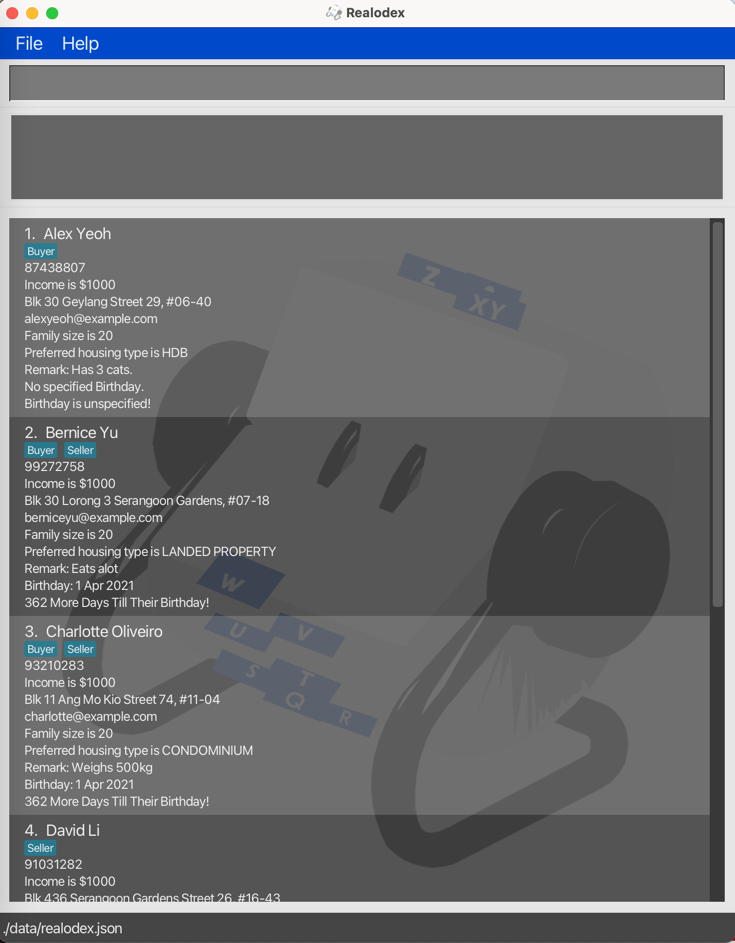

# Realodex (RDX) User Guide

Realodex (or RDX for short) is a **desktop app for managing client contacts, optimized for use via a
Command Line Interface** (CLI) while still having the benefits of a Graphical User Interface (GUI).
If you can type fast, RDX can get your contact management tasks done faster than traditional GUI apps.

<!-- * Table of Contents -->
<page-nav-print />

--------------------------------------------------------------------------------------------------------------------

## Quick start

1. Ensure you have Java `11` or above installed in your computer.

1. Download the latest `realodex.jar` from [here](https://github.com/AY2324S2-CS2103T-W10-1/tp/releases).

1. Copy the file to the folder you want to use as the _home folder_ for your Realodex.

1. Open a command terminal, `cd` into the folder you put the jar file in, and use the `java -jar realodex.jar`
command to run the application. 
   A GUI similar to the below should appear in a few seconds. Note how the app contains some sample data. 
   

1. Some example commands you can try:

   * `add n/John Doe p/98765432 i/20000 e/johnd@example.com a/311, Clementi Ave 2, #02-25 f/4 t/buyer r/Owes money.`
   Adds a contact named `John Doe` to Realodex.

   * `delete n/john doe` : Deletes the client with name `John Doe` from Realodex.

1. Refer to the [Features](#features) below for details of each command.

--------------------------------------------------------------------------------------------------------------------

## Features

<box type="info" seamless>

**Notes about the command format:** 

* Words in `UPPER_CASE` are the parameters to be supplied by the user. 
  e.g. in `add n/NAME`, `NAME` is a parameter which can be used as `add n/John Doe`.

* `PREFIX/` refers to the prefix tag associated with each user-written input.  
   e.g. in `add n/NAME r/REMARK`, `NAME` is the name parameter and `REMARK` is the remark parameter.
* `PREFIX` is case-insensitive  
   e.g. `N/` and `n/` are the same and are used to indicate a `NAME` input 
* Command words are case-insensitive 
  e.g. `add` and `ADD` both indicate the command word for `add`

* If you are using a PDF version of this document, be careful when copying and pasting commands that span multiple lines as space characters surrounding line-breaks may be omitted when copied over to the application.

* Parameters enclosed in `[]` are optional to input.

</box>

### Adding a client: `add`

Adds a client to Realodex. 

Format: `add n/NAME p/PHONE i/INCOME e/EMAIL a/ADDRESS f/FAMILY t/TAG [r/REMARK]`

- Note that `REMARK` is optional, enclosed in `[]`.
- You may input the parameters in any order (e.g. if
the command specifies `n/NAME a/ADDRESS`, `a/ADDRESS n/NAME` is also acceptable). 
- Note that the tag is to indicate if a client is a
Buyer, Seller or both, so tags only accept "buyer" or "seller" as the input (case-insensitive).

Examples:
* `add n/John Doe p/98765432 i/20000 e/johnd@example.com a/311, Clementi Ave 2, #02-25 f/4 t/Buyer r/Owes $1000.`
* `add n/Betsy Crowe a/Newgate Prison i/$0 f/1 p/94859694 e/betsyc@rocketmail.com t/Seller t/Buyer`

### Deleting a client : `delete`

Deletes the specified client from Realodex. There are 2 ways to do so: 

#### Deleting by name

Format: `delete n/NAME`

* Deletes the client of the specified `NAME` in Realodex.
* If name is **not found**, error message will be shown `"NAME" is not found`.

Example:
* `delete n/Udhaya Shanmugam` deletes the client in Realodex with the name "Udhaya Shanmugam".

#### Deleting by index

Format: `delete INDEX`

* Deletes the client of the specified `INDEX` in Realodex.
* If the index number is **invalid**, error message will be shown `The client index provided is invalid`.

Example:
* `delete 4` deletes the 4th client listed in Realodex, provided he/she exists.

### Editing clients : `edit`

Edits specified details of the client.

Format: `edit INDEX [n/NAME] [p/PHONE] [i/INCOME] [e/EMAIL] [a/ADDRESS] [f/FAMILY] [t/TAG] [r/REMARK]`

- If `INDEX` is `3`, the 3rd client's information will be edited.
- It is optional to edit any field (i.e, you can choose to edit any combination of fields so long there is at least 1).
- The current information will be overwritten with the input provided.

Examples:

- `edit 1 p/999` will overwrite the 1st client's phone number to `999`.
- `edit 2 n/Kylie  i/3333 f/5` will overwrite the 2nd client's name to `Kylie`, income to `3333` and family size to `5`.

### Filtering clients: `filter`

The filter command in Realodex allows you to narrow down your list of clients by specifying a keyphrase 
related to one of the client's attributes: name, remark, tag, birthday month, or housing type.
This feature is particularly useful when you need to focus on a
subset of your client database that meets certain criteria.

>
> When performing multiple filter operations in sequence, 
> each new filter is applied to the original, full list of clients, not the subset produced by the previous filter. 
> This approach ensures clarity and consistency in search results

<u>Filter by Name format:</u> `filter n/KEYPHRASE`

- Returns the list of clients whose names contain the specified keyphrase.
- Keyphrase input should be in valid format for names (alphanumeric) and non-empty.
- The search is **case-insensitive**.
  - `filter n/james` matches person with the name "James".
- **Partial fragments** of names will still be matched.
  - `filter n/Udh` matches a person with the name "Udhaya".
- **Comprehensive searching**, returning all persons with names containing the keyphrase.
  - `filter n/Al` returns persons named "Alicia", "Allysa", "Jamal".
  

  <em> <code>filter n/Li</code> returns persons with names like "Charlotte Oliveiro" and "David Li"</em>

<u>Filter by Remark format:</u> `filter r/KEYPHRASE`

- Returns the list of clients whose remarks include the specified keyphrase.
- Keyphrase input should be non-empty. 
This is an intentional design choice to ensure that the command is used for targeted searches, preventing the potential misinterpretation of an empty keyphrase as a request to list all clients.
- The search is **case-insensitive**. 
  - `filter r/FOOD` matches person with remark "He loves food."
- **Partial fragments** of remarks will still be matched.
  - `filter r/hand` matches person with remark "handsome".
- **Comprehensive searching**, returning all persons' names containing the keyword .
  - `filter r/love` returns persons with remarks "loves to travel", "has a lovely dog".

  <em> <code>filter r/eat</code> returns persons with remarks like "Eats alot" and "Likes to eat nasi lemak ..."</em>

<u>Filter by Tag format:</u> `filter t/TAG`

- Returns the list of clients with the specified tag(s).
- Tag input should be valid and non-empty - "Buyer" or "Seller".
- The search is **case-insensitive**.
  - `filter t/buyer` matches person with tag "Buyer".
- **Inclusive matching** of persons with multiple tags, as long as they possess the
tag(s) specified in the input.
  - `filter t/buyer` matches person with tags "Buyer" and "Seller".
- Supports searching with **multiple tags**.
  - `filter t/Buyer t/Seller` only returns persons with both "Buyer" and "Seller" tags.
- **Comprehensive searching**, returning all persons' with the specified tag(s).
    - `filter t/Seller` returns all persons tagged as "Seller".

  <em> <code>filter t/seller</code> returns persons with "Seller" Tag</em>

  <em> <code>filter t/buyer t/seller</code> only returns persons with "Buyer" and "Seller" Tag</em>

<u>Filter by Birthday format:</u> `filter b/MONTH`

- Returns the list of clients whose birthdays are in the specified month.
- Month input should be a valid month in `MMM` format and non-empty.
  - Filtering by month "September" should be `filter b/Sep`
- The month input is **case-insensitive**.
    - `filter b/SEP` matches person with Birthday in September.
- **Comprehensive searching**, returning all persons with birthdays in the specified month.
    - `filter b/Jan` returns all persons with birthday in January.
- Persons who do not have a specified birthday will **not be included** in the search results.

  <em> <code>filter b/Apr</code> returns persons with Birthday in April</em>

<u>Filter by Housing Type format:</u> `filter h/HOUSING_TYPE`

- Returns the list of clients with the specified housing type preference.
- Housing Type input should be valid and non-empty - "HDB", "Condominium", "Landed Property" or "Good Class Bungalow".
- The search is **case-insensitive**.
    - `filter h/hdb` matches person with housing type "HDB".
- **Comprehensive searching**, returning all persons with the specified housing type.
    - `filter h/Condominium` returns all persons with the "Condominium" preferred housing type.

  <em> <code>filter h/Good Class Bungalow</code> returns persons with "Good Class Bungalow" Housing Type preference</em>

### Listing clients : `list`

Lists all clients in Realodex.

Format: `list`

### Sort : `sort`

Sort clients based on their proximity to their upcoming birthday,
calculated by the number of days until their next birthday relative to the current date.

Format: `sort`

- The current date is based on the local system's time.
- If their birthday has already passed, the calculation is based on the number of days until their next birthday next year.
- If the list presented is currently a filtered list after using `filter`, sort will work on the new filtered list. 

### Clearing Realodex : `clearRealodex`

Clears all clients in Realodex.

Format: `clearRealodex`

### Help : `help`

Generates a pop-up window which is a summarised version of the User Guide.

Format: `help`

### Help (Individual Commands) : `COMMAND help`

Shows the help message for the specified command only.

Format: `COMMAND help`

Examples:
- `add help` provides the help message for the add command
- `filter help` provides the help message for the filter command

### Exiting the program : `exit`

Exits the program.

Format: `exit`

### File Data

The JSON file that stores the data of your contacts can be found in a folder named `data`, in the same folder/directory as the Realodex app. (e.g. if you
have Realodex installed in your Desktop, the `data` folder containing the file can be found in your Desktop as well.)

#### Saving Data

Realodex data is saved in the hard disk as a JSON file automatically after any command that modifies it. There is no need to save manually.

#### Editing Data 

Realodex data is saved automatically as a JSON file `[JAR file location]/data/realodex.json`. Advanced users are welcome to update data directly by editing that data file.

<box type="warning" seamless>

**Caution:**
If your changes to the data file makes its format invalid, Realodex will discard all data and start with an empty data file at the next run.  Hence, it is recommended to make a backup of the file before editing it. 
Furthermore, certain edits can cause the Realodex to behave in unexpected ways (e.g., if a value entered is outside the acceptable range). Therefore, edit the data file only if you are confident that you can update it correctly.
</box>

#### Restarting with New Data

Should you want to re-enter your contacts in a fresh JSON file in the event of file corruption or a bad edit causing the format to be incorrect,
simply delete `realodex.json` and restart the app. A new JSON file with sample contacts will be generated and you may proceed from there.

### Filtering clients by income and more `[coming soon...]`

_Details coming soon ..._

--------------------------------------------------------------------------------------------------------------------

## FAQ

**Q**: How do I transfer my data to another Computer? 
**A**: Install the app in the other computer and overwrite the empty JSON file it creates with the JSON file that contains all of your data.

--------------------------------------------------------------------------------------------------------------------

## Known issues

1. **When using multiple screens**, if you move the application to a secondary screen, and later switch to using only the primary screen, the GUI will open off-screen. The remedy is to delete the `preferences.json` file created by the application before running the application again.

--------------------------------------------------------------------------------------------------------------------

## Command summary

Action     | Format, Examples
-----------|----------------------------------------------------------------------------------------------------------------------------------------------------------------------
**Add**    | `add n/NAME p/PHONE i/INCOME e/EMAIL a/ADDRESS f/FAMILY t/TAG [r/REMARK]`   e.g. `add n/John Doe p/98765432 i/20000 e/johnd@example.com a/311, Clementi Ave 2, #02-25 f/4 r/Buyer t/Owes $1000.`
**Delete (by name)** | `delete n/NAME`  e.g. `delete n/John`
**Delete (by index)** | `delete INDEX`  e.g. `delete 3`
**Edit** | `edit INDEX [n/NAME] [p/PHONE] [i/INCOME] [e/EMAIL] [a/ADDRESS] [f/FAMILY] [t/TAG] [r/REMARK]`   e.g. `edit 2 n/Denzel i/100000`
**Filter** | `filter STRING`  e.g. `filter David`
**List**   | `list`
**Help** | `help`
**Help (individual commands)** | `COMMAND help`  e.g. `add help`,`edit help`
**Clear** | `clearRealodex`
**Exit**   | `exit`
