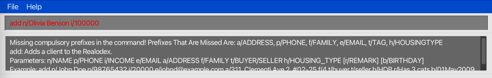
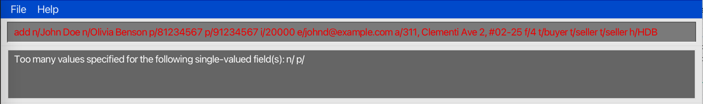
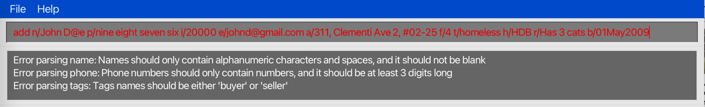
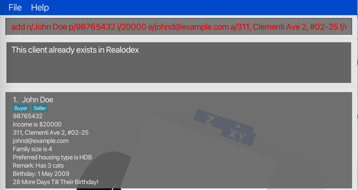

# Realodex (RDX) User Guide

Realodex (or RDX for short) is a **desktop app for managing client contacts, optimized for use via a
Command Line Interface** (CLI) while still having the benefits of a Graphical User Interface (GUI).
If you can type fast, RDX can get your contact management tasks done faster than traditional GUI apps.

<!-- * Table of Contents -->
<page-nav-print />

--------------------------------------------------------------------------------------------------------------------

## Quick start

1. Ensure you have Java `11` or above installed in your computer.

1. Download the latest `realodex.jar` from [here](https://github.com/AY2324S2-CS2103T-W10-1/tp/releases).

1. Copy the file to the folder you want to use as the _home folder_ for your Realodex.

1. Open a command terminal, `cd` into the folder you put the jar file in, and use the `java -jar realodex.jar`
command to run the application. 
   A GUI similar to the below should appear in a few seconds. Note how the app contains some sample data. 
   

1. Some example commands you can try:

   * `add n/John Doe p/98765432 i/20000 e/johnd@example.com a/311, Clementi Ave 2, #02-25 f/4 h/HDB t/buyer r/Owes money.`
   Adds a contact named `John Doe` to Realodex.

   * `delete n/john doe` : Deletes the client with name `John Doe` from Realodex.

1. Refer to the [Features](#features) below for details of each command.

--------------------------------------------------------------------------------------------------------------------

## Features

<box type="info" seamless>

**Notes about the command format:** 

* Words in `UPPER_CASE` are the parameters to be supplied by the user. 
  e.g. in `add n/NAME`, `NAME` is a parameter which can be used as `add n/John Doe`.

* `PREFIX/` refers to the prefix tag associated with each user-written input.  
   e.g. in `add n/NAME r/REMARK`, `NAME` is the name parameter and `REMARK` is the remark parameter.
* `PREFIX` is case-insensitive  
   e.g. `N/` and `n/` are the same and are used to indicate a `NAME` input
* Prefixes must not be preceded by a non-whitespace character.
   e.g. `a/6 College Avenue Westr/Has a dog` will only recognise the `a/` prefix as the `r/` prefix is preceded by `t` whihs is a non-whitespace character. 
* Command words are case-insensitive 
  e.g. `add` and `ADD` both indicate the command word for `add`

* If you are using a PDF version of this document, be careful when copying and pasting commands that span multiple lines as space characters surrounding line-breaks may be omitted when copied over to the application.

* Parameters enclosed in `[]` are optional to input.

</box>

### Adding a client: `add`

Adds a client to Realodex. 

Format: `add n/NAME p/PHONE i/INCOME e/EMAIL a/ADDRESS f/FAMILY t/TAG h/HOUSINGTYPE [r/REMARK] [b/BIRTHDAY]`

- n/NAME p/PHONE i/INCOME e/EMAIL a/ADDRESS f/FAMILY t/TAG h/HOUSINGTYPE are compulsory fields. 
  - If any of the above fields are missed out in the `add` command, you will receive an error message stating the compulsory fields that are missing in the add command.
  - For example, if only `n/NAME` and `i/INCOME` are present, you will be alerted that you are missing the fields `p/PHONE e/EMAIL a/ADDRESS f/FAMILY t/TAG h/HOUSINGTYPE`
  - 
- Except `t/TAG`, there can only be one of each fields in the add command.
  - 
- For `t/TAG`, you may input both `t/BUYER` and/or `t/SELLER` (case insensitive). 
  - If either tag is repeated more than once, for e.g. `t/BUYER t/BUYER`, the tag will only be recorded once and no error will be thrown. 
- Note that `REMARK` and `BIRTHDAY` fields are optional, enclosed in `[]`.
  - You do not need to include the prefixes for `r/REMARK` and `b/BIRTHDAY` if you do not wish to include them.
  - But if you do include the prefix with only a blank string, birthday and remark fields will be taken as not specified.
    - Example: `add n/John Doe p/98765432 i/20000 e/johnd@example.com a/311, Clementi Ave 2, #02-25 f/4 t/Buyer h/HDB r/ b/` will successfully add John Doe but remarks and birthday will be not specified. 
- Refer to the [Specific Format Requirements](#specific-formats) for each field.
  - If any of the formats are violated, you will receive an error message detailing the fields with invalid formats.
  - For example, if name, phone and tag fields are in incorrect format, you will receive 3 error messages as shown.
  - 
- You may input the parameters in any order (e.g. if the command specifies `n/NAME a/ADDRESS`, `a/ADDRESS n/NAME` is also acceptable).
- You may not have duplicate persons with the same name in realodex.
  - If you try to add duplicate persons, you will get the error message "This client already exists in Realodex".
  

#### Specific Formats for each field
* NAME: 
  * Should only contain Alphanumeric characters and must be unique
  1. Names are case-insensitive. 
  2. Number of spaces between words in the name do not matter.
  3. By default, the first letter of each word in the name will be made uppercase and the remaining letters lowercase, which is true for the majority of names in real life. 
  * Example: `n/John Doe` and `n\john   doe` are both considered the same valid name. 
* PHONE: 
  * Should only contain numbers, and it should be at least 3 digits long
  * Example: `p/81234567`
* INCOME: 
  * Income should be an integer and should be at least 0 
  * Example: `i/20000`
* EMAIL: 
  * Emails should be of the format local-part@domain and adhere to the following constraints: 
  1. The local-part should only contain alphanumeric characters and these special characters, excluding the parentheses, (+_.-). 
  2. The local-part may not start or end with any special characters. 
  3. This is followed by a '@' and then a domain name. The domain name is made up of domain labels separated by periods.\
     The domain name must:
     * end with a domain label at least 2 characters long 
     * have each domain label start and end with alphanumeric characters 
     * have each domain label consist of alphanumeric characters, separated only by hyphens, if any.
  * Example: `e/realodex-admin@gmail.com`
* ADDRESS: 
  * Must not include other command prefixes (`a/`, `b/`, `f/`, `h/`, `i/`, `n/`, `p/`, `r/`, `t/`) to prevent parsing errors. For instance, `a/lemontree street t/1` may cause the command to fail, as the system will interpret `t/` as an unintended tag prefix.
  * Example: `a/6 College Ave West`
* FAMILY: 
  * Should be an integer greater than 1. 
  * Example: `f/4`
* TAG: 
  * Only accept "buyer" or "seller" as the input (case-insensitive). Multiple tags are accepted.
  * Example: `t/buyer`, `t/seller` or both
* HOUSINGTYPE: 
  * Must be one of the following: "HDB", "CONDOMINIUM", "LANDED PROPERTY", "GOOD CLASS BUNGALOW" (case-insensitive). Only one housing type is allowed.
  * Example: `h/HDB` 
* REMARK: 
  * Can be empty if remark is not specified.
  * Must not include other command prefixes (`a/`, `b/`, `f/`, `h/`, `i/`, `n/`, `p/`, `r/`, `t/`) to prevent parsing errors. For instance, `r/Prefers block b/c` may cause the command to fail, as the system will interpret `b/` as an unintended birthday prefix.
  * Example: `r/Has a cat`
* BIRTHDAY: 
  * Should be in the form "DDMMMYYYY", and can be empty if the birthday is not specified.
  * Example: `b/22Feb2002`
  1. The date must not be in the future.
  2. The date must exist in the Gregorian calendar. (`b/29Feb2023` is not allowed)
  3. The day "DD" must be numeric. For 1st-9th day of the month, the 0 need not be present. (Example: `2Feb2002`) 
  4. The month "MMM" refers to the first 3 letters of the month (case-insensitive)
  5. The year "YYYY" must be in full and greater than or equal to 1000. (`b/29Feb02` is not allowed)

Examples:
* `add n/John Doe p/98765432 i/20000 e/johnd@example.com a/311, Clementi Ave 2, #02-25 f/4 t/Buyer h/HDB r/Owes $1000. b/27May2003`
* `add n/Betsy Crowe a/Newgate Prison i/0 f/1 p/94859694 e/betsyc@rocketmail.com t/Seller h/CONDOMINIUM t/Buyer`

### Deleting a client : `delete`

Deletes the specified client from Realodex. There are 2 ways to do so: 

#### Deleting by name

Format: `delete n/NAME`

* Deletes the client of the specified `NAME` in Realodex.
* If name is **not found**, error message will be shown `"NAME" is not found`.

Example:
* `delete n/Udhaya Shanmugam` deletes the client in Realodex with the name "Udhaya Shanmugam".

#### Deleting by index

Format: `delete INDEX`

* Deletes the client of the specified `INDEX` in Realodex.
* If the index number is **invalid**, error message will be shown `The client index provided is invalid`.

Example:
* `delete 4` deletes the 4th client listed in Realodex, provided he/she exists.

### Editing clients : `edit`

Edits specified details of the client.

Format: `edit INDEX [n/NAME] [p/PHONE] [i/INCOME] [e/EMAIL] [a/ADDRESS] [f/FAMILY] [t/TAG] [r/REMARK]`

- If `INDEX` is `3`, the 3rd client's information will be edited.
- It is optional to edit any field (i.e, you can choose to edit any combination of fields so long there is at least 1).
- The current information will be overwritten with the input provided.

Examples:

- `edit 1 p/999` will overwrite the 1st client's phone number to `999`.
- `edit 2 n/Kylie  i/3333 f/5` will overwrite the 2nd client's name to `Kylie`, income to `3333` and family size to `5`.

### Filtering clients : `filter`

Filters the list of client with an input keyphrase.

Format: `filter KEYPHRASE`

- The search is case-insensitive. e.g `james` will match `James`
- Partial words will still be matched e.g. `Udh` will match `Udhaya`
- All persons' names containing the keyword will be returned e.g. `Al` will return `Alicia`, `Allysa`

Example:

- `filter Al` will list out persons whose name has `"Al"` inside, such as `"Alicia"`, `"Allysa"` and `"Jamal"`

### Listing clients : `list`

Lists all clients in Realodex.

Format: `list`

### Sort : `sort`

Sort clients based on their proximity to their upcoming birthday,
calculated by the number of days until their next birthday relative to the current date.

Format: `sort`

- The current date is based on the local system's time.
- If their birthday has already passed, the calculation is based on the number of days until their next birthday next year.
- If the list presented is currently a filtered list after using `filter`, sort will work on the new filtered list. 

### Clearing Realodex : `clearRealodex`

Clears all clients in Realodex.

Format: `clearRealodex`

### Help : `help`

Generates a pop-up window which is a summarised version of the User Guide.

Format: `help`

### Help (Individual Commands) : `COMMAND help`

Shows the help message for the specified command only.

Format: `COMMAND help`

Examples:
- `add help` provides the help message for the add command
- `filter help` provides the help message for the filter command

### Exiting the program : `exit`

Exits the program.

Format: `exit`

### File Data

The JSON file that stores the data of your contacts can be found in a folder named `data`, in the same folder/directory as the Realodex app. (e.g. if you
have Realodex installed in your Desktop, the `data` folder containing the file can be found in your Desktop as well.)

#### Saving Data

Realodex data is saved in the hard disk as a JSON file automatically after any command that modifies it. There is no need to save manually.

#### Editing Data 

Realodex data is saved automatically as a JSON file `[JAR file location]/data/realodex.json`. Advanced users are welcome to update data directly by editing that data file.

<box type="warning" seamless>

**Caution:**
If your changes to the data file makes its format invalid, Realodex will discard all data and start with an empty data file at the next run.  Hence, it is recommended to make a backup of the file before editing it. 
Furthermore, certain edits can cause the Realodex to behave in unexpected ways (e.g., if a value entered is outside the acceptable range). Therefore, edit the data file only if you are confident that you can update it correctly.

</box>

#### Restarting with New Data

Should you want to re-enter your contacts in a fresh JSON file in the event of file corruption or a bad edit causing the format to be incorrect,
simply delete `realodex.json` and restart the app. A new JSON file with sample contacts will be generated and you may proceed from there.

### Filtering clients by income and more `[coming soon...]`

_Details coming soon ..._

--------------------------------------------------------------------------------------------------------------------

## FAQ

**Q**: How do I transfer my data to another Computer? 
**A**: Install the app in the other computer and overwrite the empty JSON file it creates with the JSON file that contains all of your data.

--------------------------------------------------------------------------------------------------------------------

## Known issues

1. **When using multiple screens**, if you move the application to a secondary screen, and later switch to using only the primary screen, the GUI will open off-screen. The remedy is to delete the `preferences.json` file created by the application before running the application again.

--------------------------------------------------------------------------------------------------------------------

## Command summary

| Action                         | Format, Examples                                                                                                                                                                                                 |
|--------------------------------|------------------------------------------------------------------------------------------------------------------------------------------------------------------------------------------------------------------|
| **Add**                        | `add n/NAME p/PHONE i/INCOME e/EMAIL a/ADDRESS f/FAMILY t/TAG [r/REMARK] [b/BIRTHDAY]`   e.g. `add n/John Doe p/98765432 i/20000 e/johnd@example.com a/311, Clementi Ave 2, #02-25 f/4 r/Buyer t/Owes $1000.` |
| **Delete (by name)**           | `delete n/NAME`  e.g. `delete n/John`                                                                                                                                                                         |
| **Delete (by index)**          | `delete INDEX`  e.g. `delete 3`                                                                                                                                                                               |
| **Edit**                       | `edit INDEX [n/NAME] [p/PHONE] [i/INCOME] [e/EMAIL] [a/ADDRESS] [f/FAMILY] [t/TAG] [h/HOUSINGTYPE] [r/REMARK] [b/BIRTHDAY]`   e.g. `edit 2 n/Denzel i/100000`                                                 |
| **Filter**                     | `filter STRING`  e.g. `filter David`                                                                                                                                                                          |
| **List**                       | `list`                                                                                                                                                                                                           |
| **Help**                       | `help`                                                                                                                                                                                                           |
| **Help (individual commands)** | `COMMAND help`  e.g. `add help`,`edit help`                                                                                                                                                                   |
| **Clear**                      | `clearRealodex`                                                                                                                                                                                                  |
| **Exit**                       | `exit`                                                                                                                                                                                                           |
