# Realodex User Guide
## Welcome to Realodex!
**Realodex** is your ultimate client management tool tailored specifically for the dynamic needs of real estate professionals. Designed to streamline the day-to-day operations of realtors, brokers, and real estate agencies, Realodex offers seamless functionality to ***add***, ***edit***, ***search***, and ***delete*** client information effortlessly.

- **Add**: Quickly input new client data, from contact details to property preferences, building a rich, actionable database.
- **Edit**: Easily update client information to keep profiles accurate and comprehensive, reflecting the latest changes in their needs or status.
- **Search**: Instantly locate client profiles using robust filters, enabling swift responses and tailored service.
- **Delete**: Safely remove outdated information, ensuring your database is current and compliant.

<div style="text-align: center;">
    <a href="images/realodex_icon.png">
        
    </a>
</div>

## Why Choose Realodex?
With our **intuitive interface** and **advanced features**, real estate users can manage their client database with unprecedented ease, enhancing their productivity and enabling them to focus on what they do best: closing deals and building lasting relationships.

Whether you're a seasoned real estate veteran or a rising star in the industry, Realodex is your partner in achieving operational excellence and superior client service.

**New to Realodex?** Rest assured—this user guide delivers thorough documentation on utilizing Realodex’s current features, provides answers to frequently asked questions, and sheds light on future enhancements. Kickstart your journey by delving into the [Quick Start](#quick-start
) section, crafted to guide you through the functionalities that will elevate your real estate endeavours.


<!-- * Table of Contents -->
<page-nav-print />

--------------------------------------------------------------------------------------------------------------------
## Quick start

1. **Check Java Installation** Ensure you have Java `11` or above installed in your computer.

<box type="info" light>
<tabs>
<tab header="Windows">

1. Open command-prompt, by typing cmd in your start menu.
2. Type `java --version` and enter to check if Java is installed and to the right version.
   Below image is the expected output if the correct version of Java is installed. 
   The red box indicates the expected Java version you should see.
   <br>
  <div style="display:flex; justify-content: center; align-items:center;">
    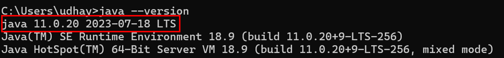
  </div>

3. If Java is not installed or the wrong version is installed,
   please install Java 11 from the official site
   or click [here](https://www.oracle.com/sg/java/technologies/javase/jdk11-archive-downloads.html).
</tab>
<tab header="Mac"> 

1. Open Terminal.
2. Type `java --version` and enter to check if Java is installed and to the right version.
   Below image is the expected output if the correct version of Java is installed.
   The red box indicates the expected Java version you should see. 
   <br>
  <div style="display:flex; justify-content: center; align-items:center;">
    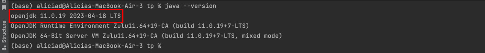
  </div>

3. If Java is not installed or the wrong version is installed, please install Java 11 from the official site.
</tab>
</tabs>
</box>

<div style="page-break-after: always;"></div>

2. **Download Realodex** You can download the latest `realodex.jar` from [here](https://github.com/AY2324S2-CS2103T-W10-1/tp/releases).
   <br>
  <div style="display:flex; justify-content: center; align-items:center;">
    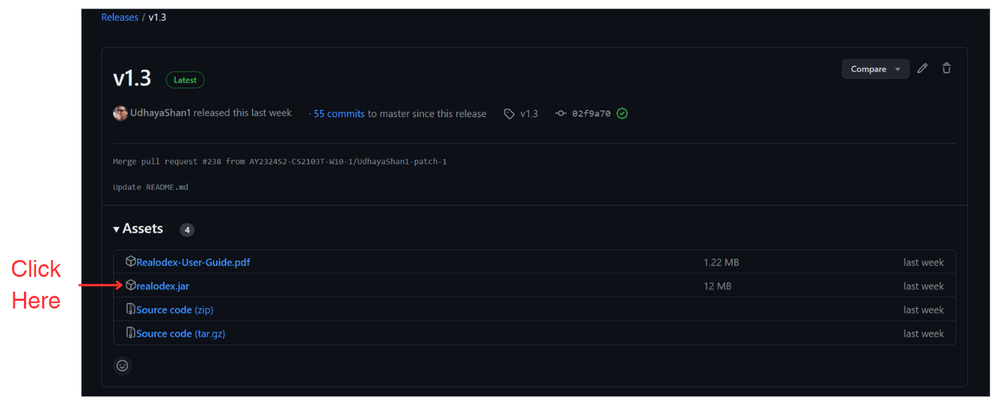
  </div>
<br>

3. **Set up Realodex** You should copy the file to the folder you want to use as the _home folder_ for your Realodex.

<box type="tip"><md>We highly recommend you running Realodex in an empty folder as pre-existing JSON files may cause bugs!</md></box>

4. **Navigate to Workspace** Open a command terminal, change directory into the folder by using change directory command,
   `cd`, and navigating to the folder you put the jar file in
   <br>
  <div style="display:flex; justify-content: center; align-items:center;">
    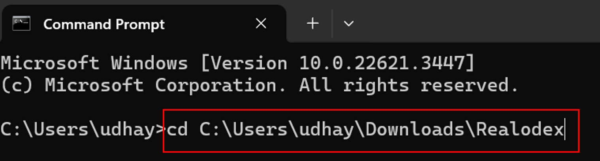
  </div>
<br>

5. **Run Realodex** Run `java -jar realodex.jar ` in the same terminal opened to start Realodex.
   <br>
  <div style="display:flex; justify-content: center; align-items:center;">
    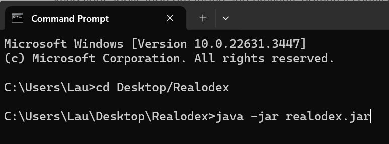
  </div>
<br>
<box type="warning">While the screenshots are from Windows OS, the commands are the same for other OS as well!.</box>

5. You should see a GUI similar to image below pop up. Note how the app contains some pre-populated sample data!
   <br>
  <div style="display:flex; justify-content: center; align-items:center;">
    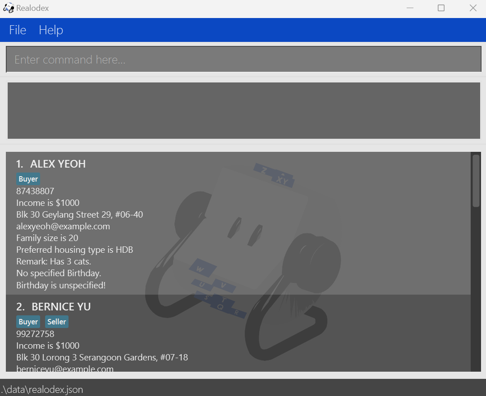
  </div>
<br>


5. **Try out some Realodex features!** Some example commands you can try:

   * `add n/John Doe p/98765432 i/20000 e/johnd@example.com a/311, Clementi Ave 2, #02-25 f/4 h/HDB t/buyer r/Owes money.`
   Adds a contact named `John Doe` together with his details to Realodex.

   * `delete n/john doe` : This will delete the client with name `John Doe` from Realodex.

6. Refer to the [Features](#features) below for details of each command.
----
## Using this Guide
Our goal is to empower you with the knowledge and confidence to unleash the full potential of Realodex. 

We have equipped Realodex with the following features.
- **Effortless Navigation**: Use the table of contents for seamless navigation between sections.
- **Quick Start for New Users**: New to Realodex? Get started with our Quick Start Guide as we handhold you through the process of setting up Realodex.
- **Features**: Learn more about Realodex's features and how to use them with our Features section.
- **Tutorial**: Get a step-by-step walkthrough of Realodex's features with our Tutorial.
  <box type="info">Look out for these boxes for things to note when using Realodex</box>
  <box type="tip">Look out for these boxes for tips and tricks on how to best use Realodex</box>
  <box type="warning">These boxes are for more context and warnings</box>
  <box type="wrong">These boxes are for errors and failure messages</box>

## Glossary

| Abbreviation/Nomenclature      | Meaning                                                                                                                                                                                                  |
|--------------------------------|----------------------------------------------------------------------------------------------------------------------------------------------------------------------------------------------------------|
| GUI (Graphical User Interface) | It is the digital interface which you interact with when using Realodex!                                                                                                                                 |
| GUI Components                 | A specific component of the GUI. For more information on specific GUI components, refer to this section.                                                                                                 |
| CLI (Command Line Interface)   | A text-based user interface to interact with the application.                                                                                                                                            |
| Command                        | An input from you that tells Realodex to execute an action. You can refer to the command summary [here](#command-summary)!                                                                               |
| Prefix                         | Prefixes are like fields in a form you are required to fill up. They are information needed to be passes together with the command so that it can be executed. View our Prefix Summary for more details! |
| Case-Sensitive                 | The casing of the alphabetic characters matters (e.g. “ReAlOdEx” is different from “realodex”                                                                                                            |
| Case-Insensitive               | The casing of the alphabetic characters does not matter (e.g. “ReAlOdEx” is taken to be same as “realodex”                                                                                               |

---

--------------------------------------------------------------------------------------------------------------------
<div style="page-break-after: always;"></div>

## Navigating the GUI

Realodex has a Graphical User Interface (GUI) designed to provide a seamless user experience. The GUI is divided into several components. 
Here is a brief overview of the GUI components:

### Basic Orientation

<a href="images/navigating-gui/basic_orientation.png">
  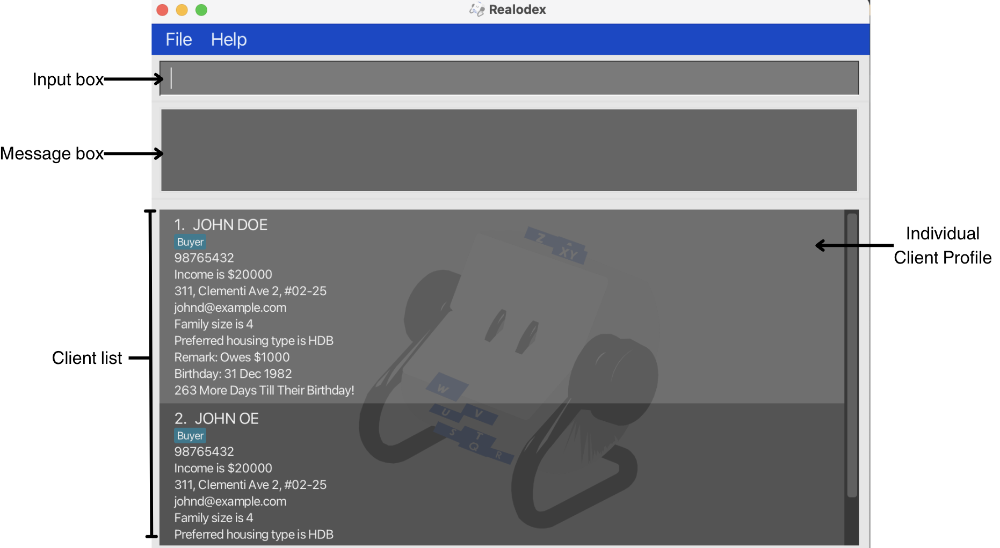
  </a>

### Client Profile

<a href="images/navigating-gui/client_profile.png">
  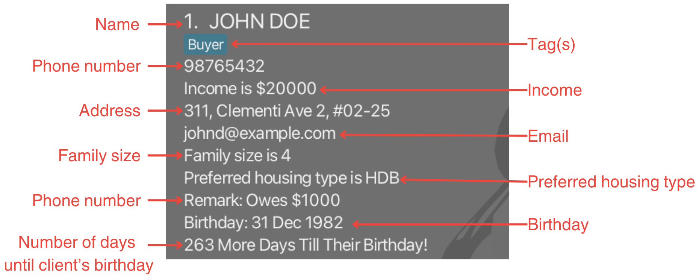
  </a>

--------------------------------------------------------------------------------------------------------------------
<div style="page-break-after: always;"></div>

## Realodex Tutorial
If this is your first time here, we encourage you to follow along in this short tutorial to get a feel of how Realodex works.
Let's begin!

1. **Starting Realodex.** Launch Realodex. The app will show up as follows:
   <a href="images/tutorial/Launch.png" style="display: block; margin: 0 auto; text-align: center;">
   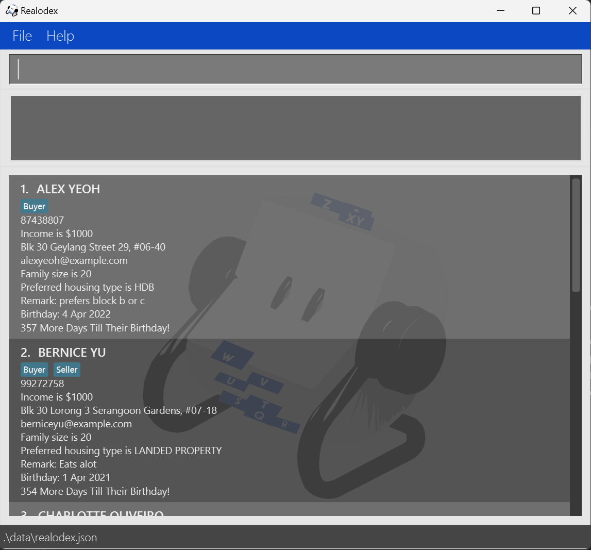
   </a>


<box type="info">If this is your first time, some sample entries will be loaded for you.</box>

2. **Adding a client.** Let us try to add a new client into Realodex. Key in `add n/John Doe p/98765432 i/20000 e/johnd@example.com a/311, Clementi Ave 2, #02-25 f/4 t/buyer t/seller h/HDB r/Has 3 cats b/01May2009`
and press Enter. New client John Doe has now been added!
   <a href="images/tutorial/AddJohnDoe.png" style="display: block; margin: 0 auto; text-align: center;">
   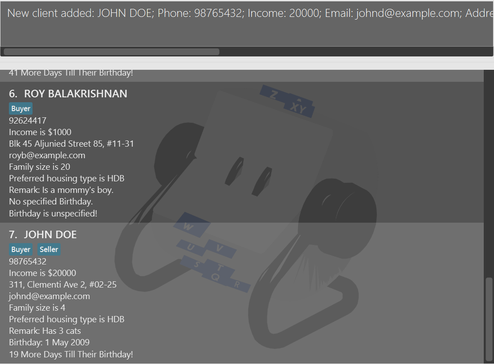
   </a>


3. **Add more clients.** Congratulations! You have just added your first ever client into Realodex. Feel free to try adding more clients before proceeding!
Here are some extra clients you may try adding:
   - `add n/James p/91234567 i/5000 e/james@gmail.com a/Jurong West Central 1 f/4 t/buyer h/HDB r/Likes to eat. b/01Sep1990`
   - `add n/Benedict p/98877665 i/8000 e/ben@gmail.com a/University Town, NUS f/6 t/seller h/CONDOMINIUM r/Favourite colour is blue. b/24Jun2000`

4. **Filter clients.** Notice that the list is a little crowded now and we want to search for John. Key in `filter n/John`
to look for our new client.
   <a href="images/tutorial/FilterJohnDoe.png" style="display: block; margin: 0 auto; text-align: center;">
   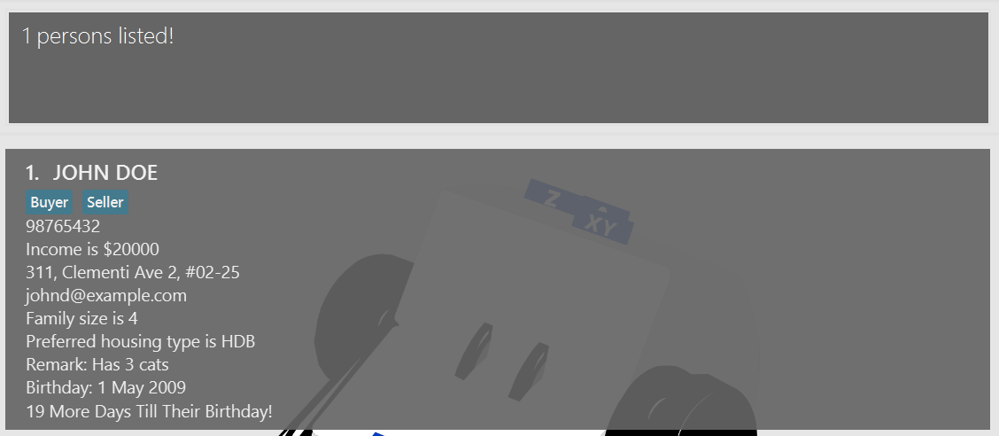
   </a>

5. **Listing all clients.** We are now done looking at John's details, let us bring up the whole list again. Simply key in `list`.
   <a href="images/tutorial/List.png" style="display: block; margin: 0 auto; text-align: center;">
   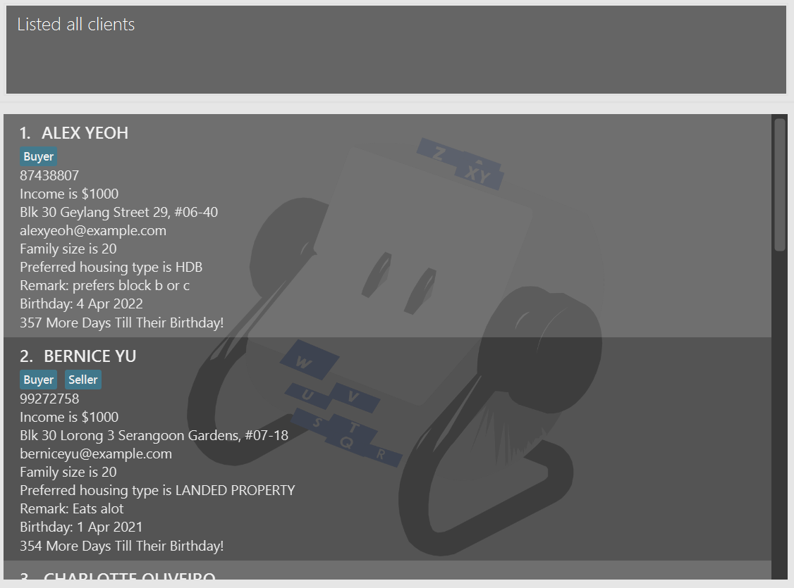
   </a>
6. **Editing clients.** Your new client John Doe has gotten a pay raise! Let's edit his income to reflect this change. First, let's take note of his index number.
   <a href="images/tutorial/IndexJohnDoe.png" style="display: block; margin: 0 auto; text-align: center;">
   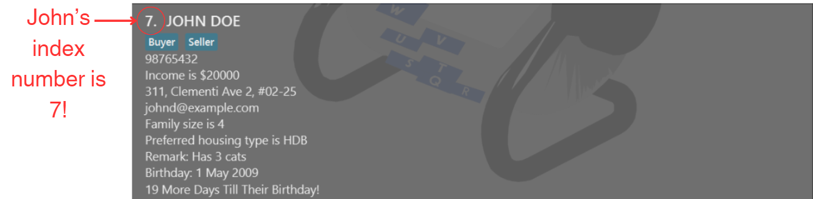
   </a>
Since John's index number is 7, key in `edit 7 i/88888`. Notice that his income will change to 88888!
   <a href="images/tutorial/IncomeJohnDoe.png" style="display: block; margin: 0 auto; text-align: center;">
   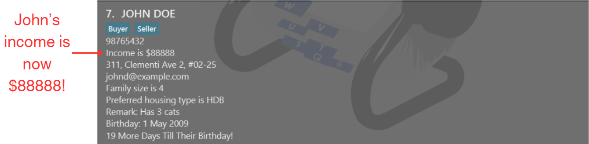
   </a>
7. **Deleting a client.** We are now done with John Doe. Let us delete him from Realodex. Key in `delete n/John Doe`. A message will be printed to indicate successful deletion. Notice that the last client is now Roy, not John as he has been deleted.
   <a href="images/tutorial/DeleteJohnDoe.png" style="display: block; margin: 0 auto; text-align: center;">
   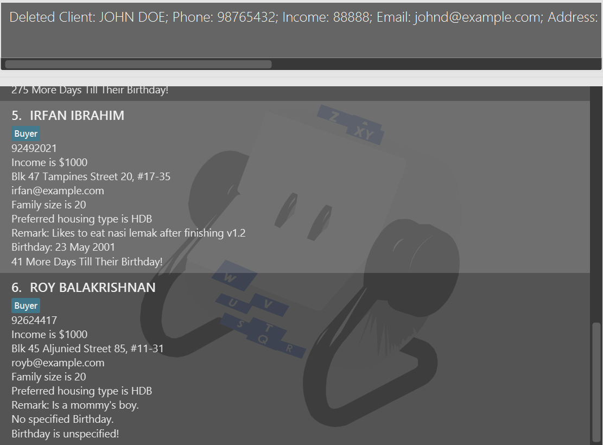
   </a>
8. **Getting Help.** Should you need help on how to use the commands, you can key in `help`.
   <a href="images/tutorial/HelpWindow.png" style="display: block; margin: 0 auto; text-align: center;">
   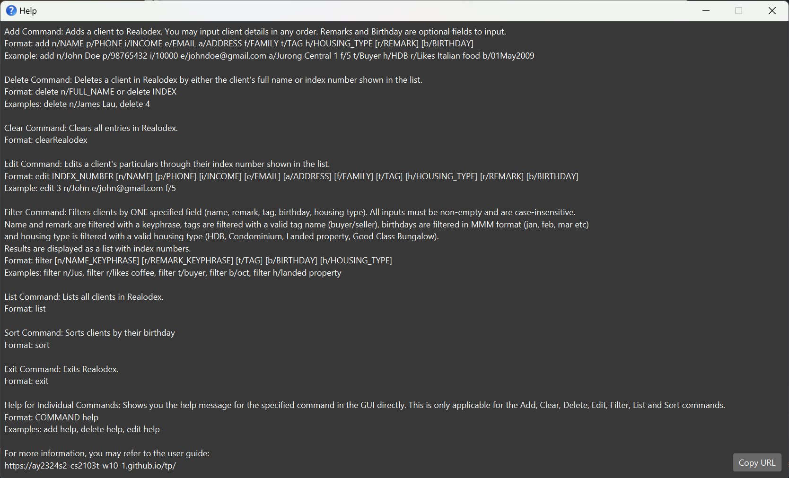
   </a>
You may also get help for individual commands. Try it out with `delete help`. A message showing you how to use the `delete` command will be shown.
   <a href="images/tutorial/DeleteHelp.png" style="display: block; margin: 0 auto; text-align: center;">
   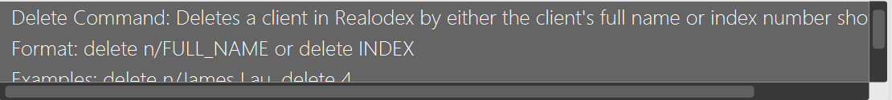
   </a>

Congratulations! You are now ready to use Realodex! Read on to learn more about more features. 

## Features

<box type="info" seamless>

**Notes about the command format:**<br>

* Commands are generally in the format `COMMANDWORD PREFIX_ONE/UPPER_CASE PREFIX_TWO/UPPER_CASE ....`
* `COMMANDWORD` refers to the various commands user can input. <br>Examples include `add`, `delete`, `filter`. A summary of all commands and their usages can be found in the [Commands Summary](#command-summary) table.

* `COMMANDWORD` is case-insensitive, i.e.`add` and `ADD` both indicate the command word for `add`.
* `PREFIX/` refers to the prefix tag associated with each user-written input. <br>
   e.g. in `add n/NAME r/REMARK`, `NAME` is the name parameter and `REMARK` is the remark parameter.
* `PREFIX` is case-insensitive, i.e.`N/` and `n/` are the same and are used to indicate a `NAME` input.
* `PREFIX` must be preceded by a whitespace character.
   e.g. `a/6 College Avenue Westr/Has a dog` will only recognise the `a/` prefix as the `r/` prefix is preceded by `t` which is not a whitespace character.
* Words in `UPPER_CASE` are the parameters to be supplied by the user.<br>
  e.g. in `add n/NAME ....`, `NAME` is a parameter which can be used as `add n/John Doe ....`.
  <br> For more details on the parameters, do refer to the [Field Constraints](#field-constraints).

* Parameters enclosed in `[]` are optional to input.<br>e.g. `[r/REMARK]` indicates an optional input field for that command.

* You may input the parameters in any order (e.g. if the command specifies `n/NAME a/ADDRESS`, `a/ADDRESS n/NAME` is also acceptable).

* If you are using a PDF version of this document, be careful when copying and pasting commands that span multiple lines as space characters surrounding line-breaks may be omitted when copied over to the application.


</box>

### Adding a client: `add`

Adds a client to Realodex.

<u>Format</u>: `add n/NAME p/PHONE i/INCOME e/EMAIL a/ADDRESS f/FAMILY t/TAG h/HOUSING_TYPE [r/REMARK] [b/BIRTHDAY]`

<box type="info">

  * `n/NAME`,`p/PHONE`,`i/INCOME`,`e/EMAIL`,`a/ADDRESS`,`f/FAMILY`,`t/TAG` and `h/HOUSING_TYPE` are compulsory fields. 
    * If any of the above fields are missed out in the `add` command, you will receive an error message informing you of the compulsory fields that you missed. 
  * Except `t/TAG`, there can only be one of each field in the add command.
  * 
</box>

<box type="warning">

* There are specific requirements for each field. 
* Refer to [Field Constraints](#field-constraints) for more information.
</box>


[//]: # (- For `t/TAG`, you may input both `t/BUYER` and/or `t/SELLER` &#40;case insensitive&#41;.)

[//]: # (  - If either tag is repeated more than once, for e.g. `t/BUYER t/BUYER`, the tag will only be recorded once and no error will be thrown.)

[//]: # (- Note that the `r/REMARK` and `b/BIRTHDAY` fields are optional, enclosed in `[]`. You may choose to omit them.)

[//]: # (  - If you include the prefix with a blank input, the birthday and remark fields will be taken as not specified.)

[//]: # (    - Example: `add n/John Doe p/98765432 i/20000 e/johnd@example.com a/311, Clementi Ave 2, #02-25 f/4 t/Buyer h/HDB r/ b/` will successfully add John Doe but remarks and birthday will be not specified.)

[//]: # (- Each field has constraints to the inputs it can accept. Do refer to the [Field Constraints]&#40;#field-constraints&#41; for more information.)

[//]: # (  - If any of the constraints are violated, you will receive an error message detailing the fields with invalid formats.)

[//]: # (  - For example, if `n/NAME`,`p/PHONE` and `t/TAG` fields do not fulfil the contraints, you will receive 3 error messages as shown.)

[//]: # (    <a href="parsing_errors.png">)

[//]: # (    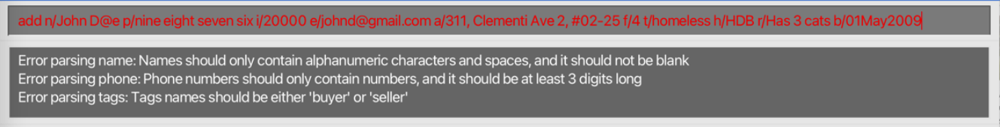)

[//]: # (    </a>)

[//]: # (- You **cannot** have duplicate persons with the same name in Realodex.)

[//]: # (  - Names are case-insensitive as described in [Field Constraints]&#40;#field-constraints&#41;.)

[//]: # (  - If you try to add duplicate persons, you will get the error message "This client already exists in Realodex".)

[//]: # (    <a href="images/add-command/duplicate_person_error.png">)

[//]: # (    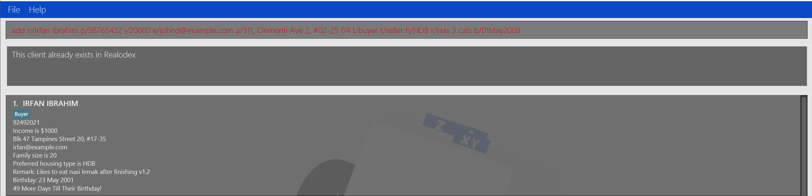)

[//]: # (    </a>)

<u>Examples</u>:
* `add n/John Doe p/98765432 i/20000 e/johnd@example.com a/311, Clementi Ave 2, #02-25 f/4 t/Buyer h/HDB r/Owes $1000. b/27May2003`
  * Adds John Doe with specified details into Realodex
  * 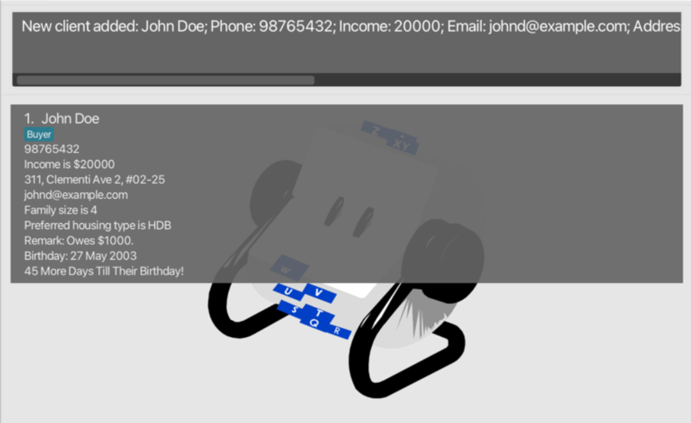
* `add n/Betsy Crowe a/Newgate Prison i/0 f/1 p/94859694 e/betsyc@rocketmail.com t/Seller h/CONDOMINIUM t/Buyer`

--------------------------------------------------------------------------------------------------------------------
<div style="page-break-after: always;"></div>
  
### Deleting a client : `delete`

Deletes the specified client from Realodex. There are 2 ways to do so:

#### Delete By Name

Delete the client with the specified `NAME` in the current Realodex list (filtered/unfiltered).

**Format:**
<box>`delete n/NAME`</box>

**Examples:**
* `delete n/Udhaya Shanmugam` deletes the client in Realodex with the name "Udhaya Shanmugam".


<p align="center">
  <a href="images/delete/before_execute_deletename.png">
  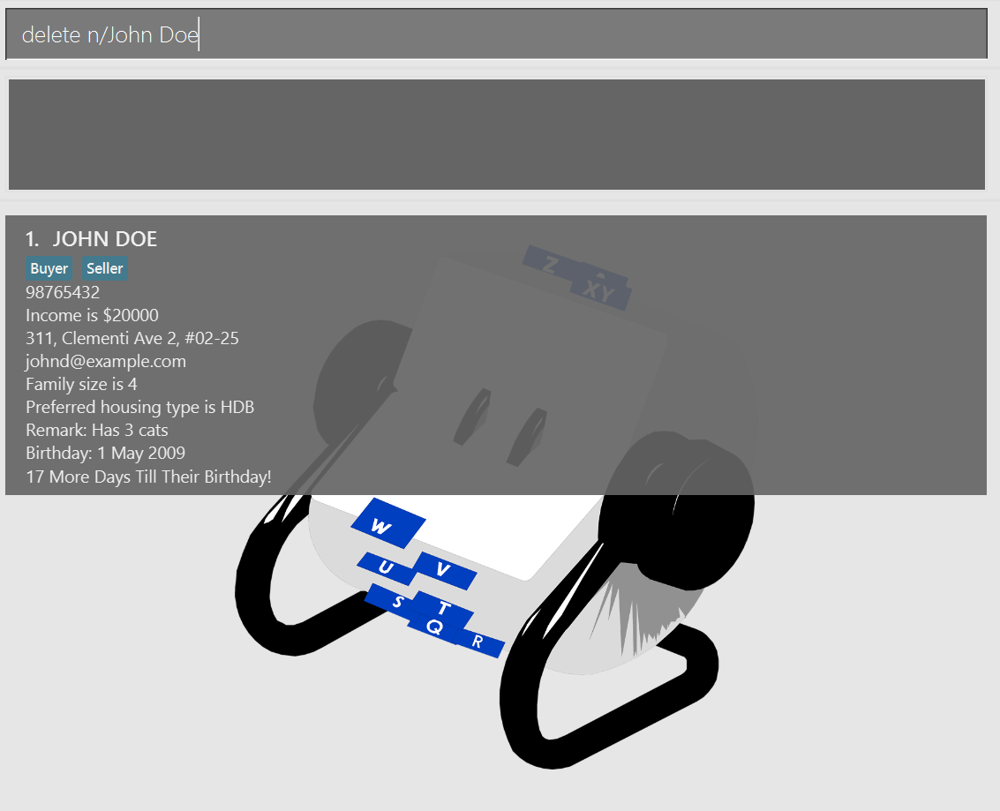
  </a>
  <em> Client list before entering command <code>delete n/Udhaya Shanmugan</code></em>
</p>


<p align="center">
  <a href="images/delete/after_execute_deletename.png">
  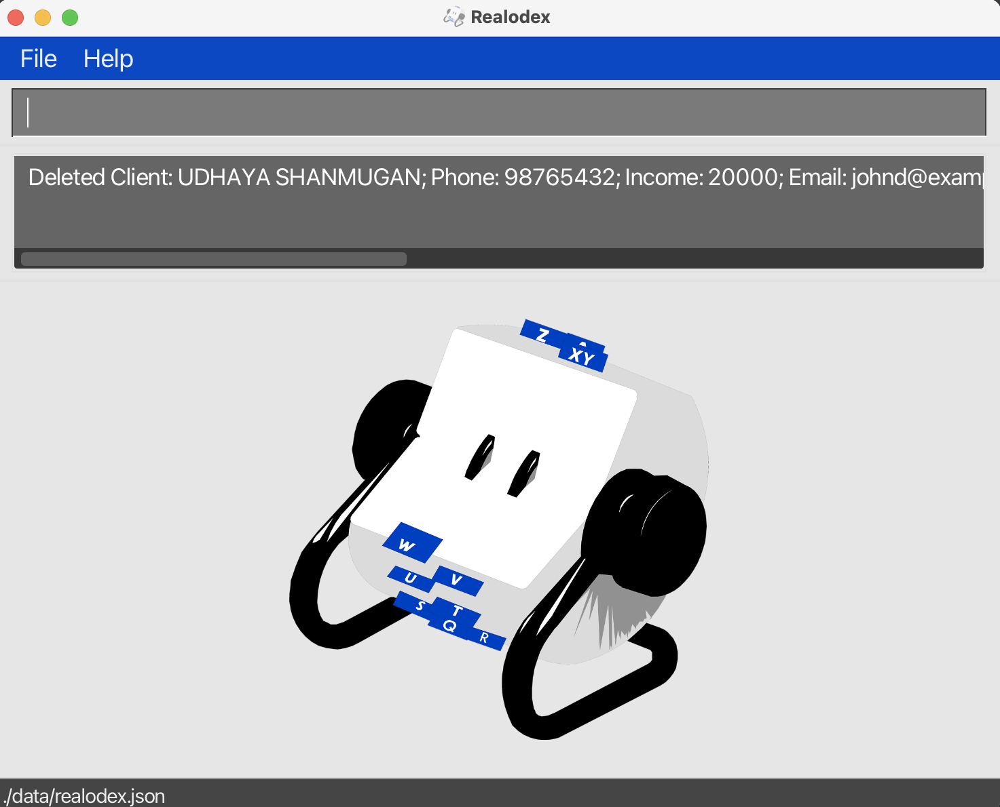
  </a>
  <em> Client list after entering command <code>delete n/Udhaya Shanmugan</code></em>
</p>

<box type="info">
💡 `NAME` is case-insensitive, i.e. `delete n/Udhaya Shanmugan` is the same as `delete n/udhAYA shanmUgAn` <br>
⚠️ If the current list is filtered, `delete n/NAME` for a `NAME` that is in the **unfiltered** list but not the current **filtered** list will not delete the client with `NAME`! <br>
⚠️ If `NAME` is **not found** in the **current** list, error message will be shown "The client name provided is invalid". <br>
</box>

#### Delete By Index

Deletes the client of the specified `INDEX` in Realodex.

**Format:**
<box>`delete INDEX`</box>

**Examples:**
* `delete 3` deletes the 3th client listed in Realodex, provided there are 3 or more entries.

<p align="center">

  <a href="images/delete/before_execute_deleteindex.png">
  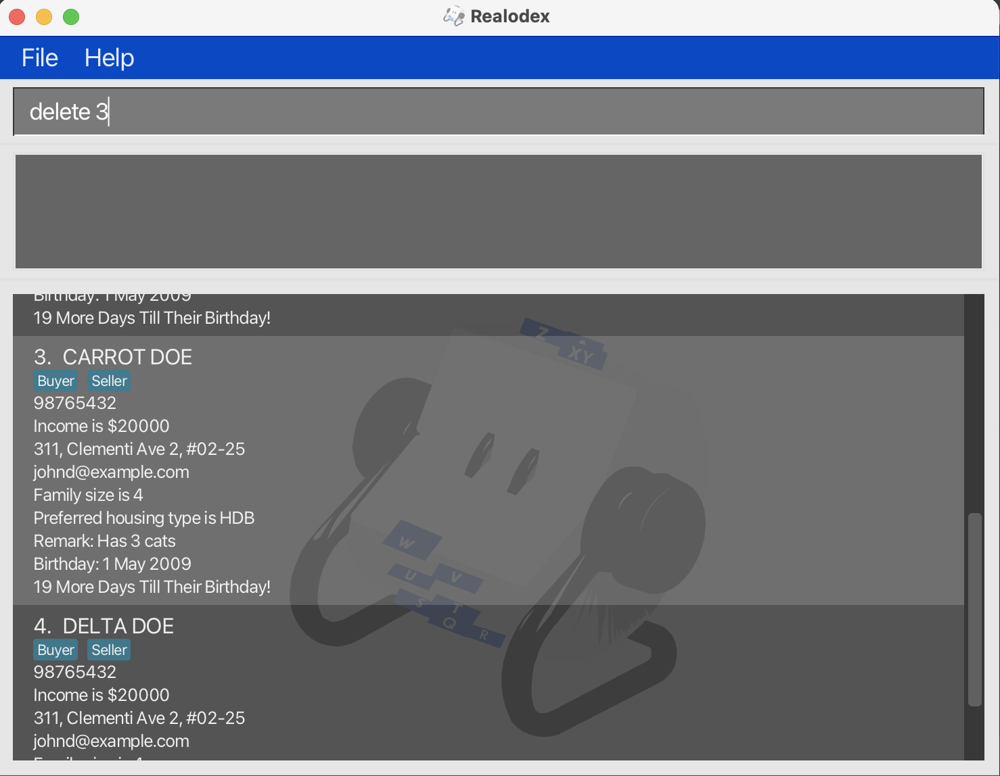 
  </a>

  <em> Client list before entering command <code>delete 3</code></em>
</p>


<p align="center">

  <a href="images/delete/after_execute_deleteindex.png"> 
  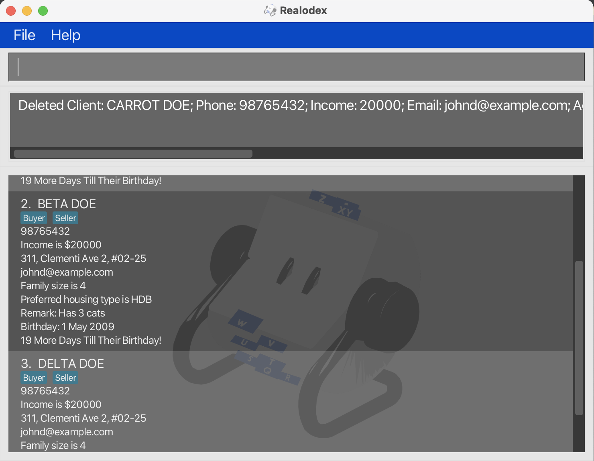 
  </a>

  <em> Client list after entering command <code>delete 3</code></em>
</p>

<box type="info">
💡 If you are currently filtered, the index will be based on the filtered list. <br>
* If `INDEX` is **more than the number of clients in Realodex**, error message will be shown "The client index provided is invalid." <br>
* If 'INDEX` is a non-zero unsigned integer, error message will be shown "Index is not a non-zero unsigned integer." <br>

</box>

[Back to Table of Contents](#table-of-contents)

--------------------------------------------------------------------------------------------------------------------
<div style="page-break-after: always;"></div>

### Editing clients : `edit`

Edits specified details of the client.

**Format:**
<box>`edit INDEX [n/NAME] [p/PHONE] [i/INCOME] [e/EMAIL] [a/ADDRESS] [f/FAMILY] [t/TAG] [h/HOUSINGTYPE] [r/REMARK] [b/BIRTHDAY]`</box>

**Examples:**
* `edit 2 n/Kylie  i/3333 f/5` will overwrite the 2nd client's (if they exist) name to "Kylie", income to "3333" and family size to "5".


<p align="center">

  <a href="images/edit/before_execute_edit.png">
  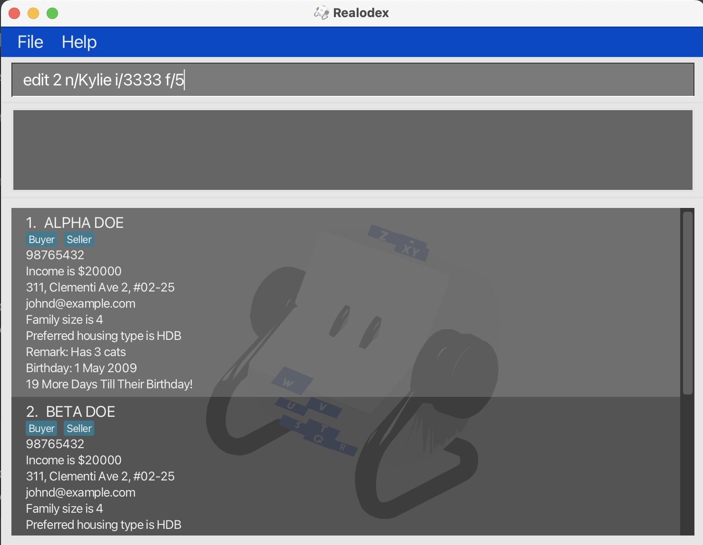
  </a>

  <em> Client list before entering command <code>edit 2 n/Kylie  i/3333 f/5</code></em>
</p>


<p align="center">

  <a href="images/edit/after_execute_edit.png">
  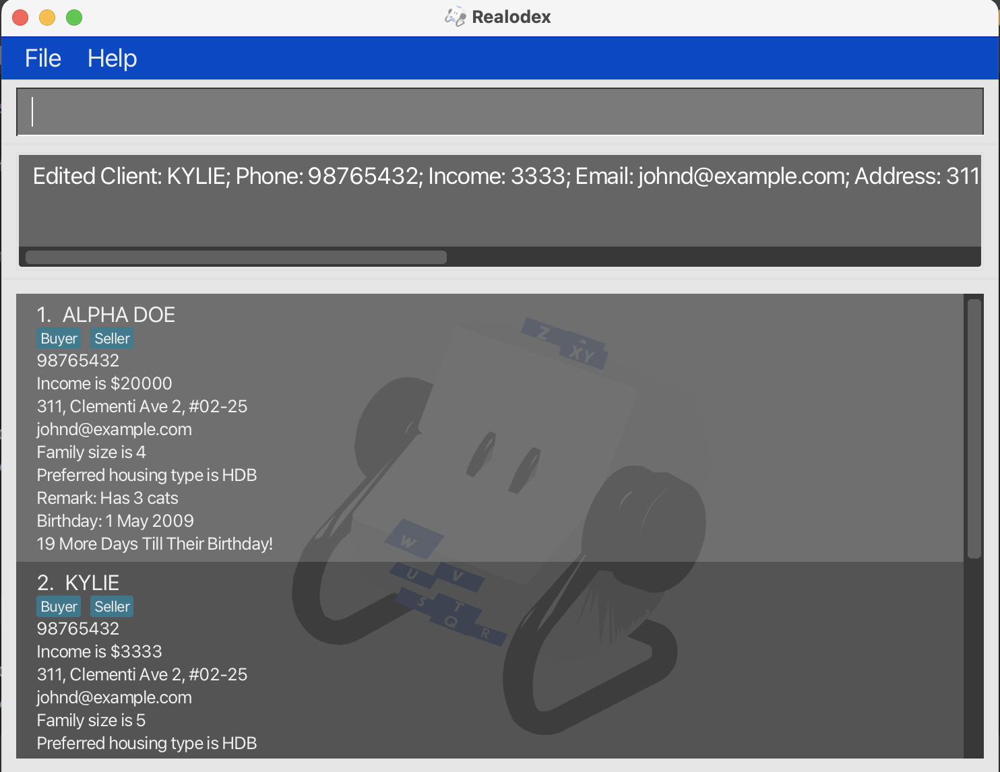
  </a>

  <em> Client list after entering command <code>edit 2 n/Kylie  i/3333 f/5</code></em>
</p>


<box type="info">
💡 If you are currently filtered, the index will be based on the filtered list.<br>

💡 It is optional to edit any field (i.e, you can choose to edit any combination of fields so long there is at least 1).<br>

💡 The current information will be overwritten with the input provided. <br>
⚠️ When editing the `TAG`, all existing tags will be overwritten with the new tag(s) provided. If you want to edit the client to be both a buyer and seller, include both tags i.e. `t/Buyer t/Seller`. <br>
🗒️ All fields must follow the respective [Field Constraints](#field-constraints).<br>
</box>

[Back to Table of Contents](#table-of-contents)

--------------------------------------------------------------------------------------------------------------------
<div style="page-break-after: always;"></div>

### Filtering clients: `filter`

The filter command in Realodex allows you to narrow down your list of clients by specifying one of the client's attributes: name, remark, tag, birthday month, or housing type.
This feature is particularly useful for targetting a
specific segment of your client database that fulfills a certain criteria.

<box type="info" header="Things to note:">

- The next command will apply to the filtered list of clients.
- The search is **case-insensitive** for all input parameters.

</box>


#### Filter By Name
Returns the list of clients whose names contain the specified keyphrase.

**Format:** 
```
filter n/KEYPHRASE
```

<box type="warning" header="Warning:">

- Name input should be alphanumeric and non-empty.
</box>

**Example:**
1. Run `filter n/Li`.
2. Persons with names containing "li" are returned.
3. In this example, "Charlotte Oliveiro" and "David Li" are returned. 

<a href="images/filter/filterByNameScreenshot.png">
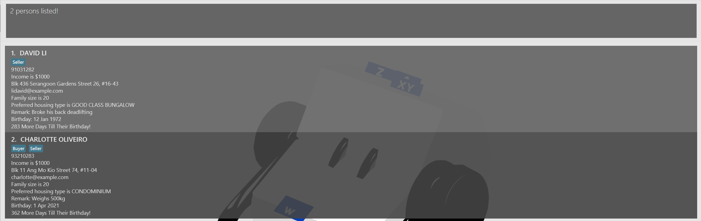
</a>

<br>

#### Filter By Tag
Returns the list of clients with the specified tag(s).

**Format:**
```
filter t/TAG(s)
```

<box type="info" header="Things to note:">

- Filtering with the "Buyer" or "Seller" tag retrieves all clients with the respective tag.
- Filtering by multiple tags is supported, `filter t/Buyer t/Seller`, returns clients who possess both buyer and seller tags.
</box>


<box type="warning" header="Warning:">

- Input tag(s) should only be "Buyer" or "Seller"
</box>

**Examples:**

1. Run `filter t/seller`.
2. Persons with "Seller" tag are returned.

    <a href="images/filter/filterByTagSeller.png">
      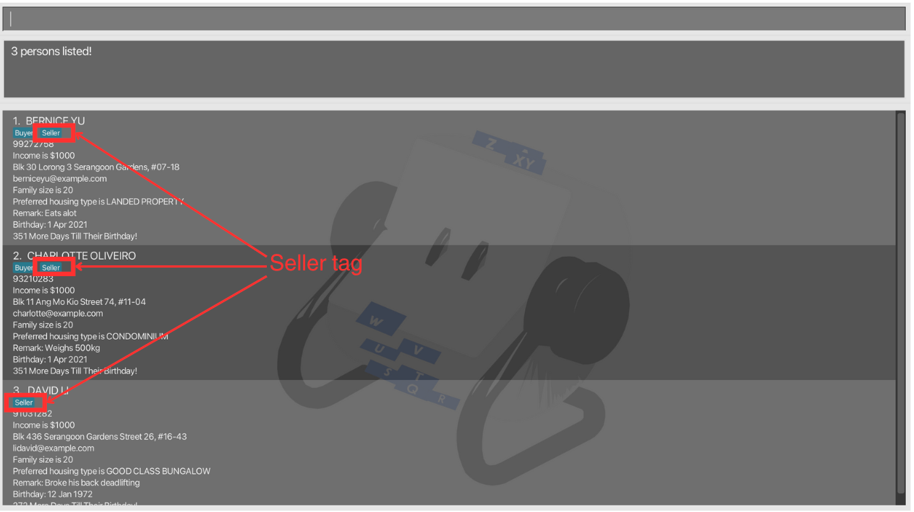
      </a>

---

1. Run `filter t/buyer t/seller`. 
2. Persons with both "Buyer" and "Seller" tags are returned.

   <a href="images/filter/filterByTagBuyerSeller.png">
      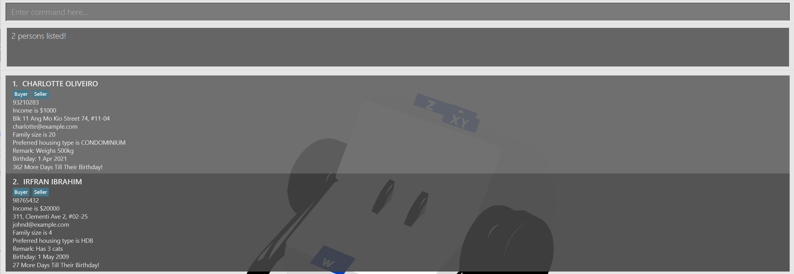
      </a>

#### Filter By Housing Type
Returns the list of clients with the specified preferred housing type.

**Format:**
```
filter h/HOUSING_TYPE
```

<box type="warning" header="Warning:">

- Input housing type should be "HDB", "Condominium", "Landed Property" or "Good Class Bungalow"
</box>

**Examples:** 
1. Run `filter h/Good Class Bungalow`.
2. Persons with both "Good Class Bungalow" housing preference are returned.

  <a href="images/filter/filterByHousingType.png">
  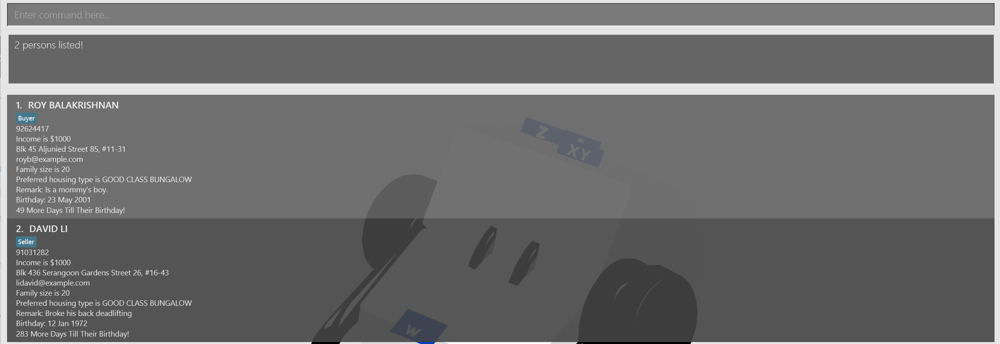
  </a>

#### Filter By Remark
Returns the list of clients whose remarks include the specified keyphrase.

**Format:**
```
filter r/KEYPHRASE
```
<box type="info" header="Things to note:">

- Partial fragments of remarks will still be matched.
  - `filter r/hand` matches person with remark "handsome".
     
  </box>
   
<box type="warning" header="Warning:">

- Input remark must be non-empty, preventing empty remark input as a request to list all clients.
- The remarks for the filter r/ command must not contain any other prefixes which could be misconstrued as additional prefixes.
  <box type="wrong" header="Error:">

  - The command `filter r/ my tag is t/buyer` would cause an error because the system interprets t/ as the start of a new prefix. 
    </box>
  
</box>

**Example:**
1. Run `filter r/eat`.
2. Persons with remarks like "Eats alot" and "Likes to eat nasi lemak ..." are returned.

  <a href="images/filter/filterByRemarkScreenshot.png">
    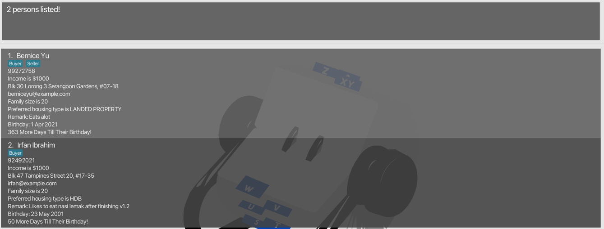
    </a>


#### Filter By Birthday Month
Returns the list of clients whose birthdays fall in the specified month.

**Format:**
```
filter b/MONTH
```

<box type="info" header="Things to note:">

- Month input should be in 3-letter abbrieviation (MMM) format. 
  - "Jan" for January
  - "Feb" for February

</box>


**Example:**

1. Run `filter b/Apr`
2. Persons with birthday in April are returned.

<a href="images/filter/filterByBirthday.png">
  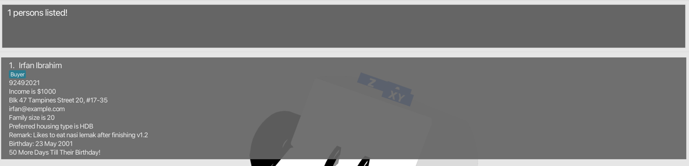
  </a>

### Listing clients : `list`

Lists all clients in Realodex.

<u>Format:</u> `list`

--------------------------------------------------------------------------------------------------------------------

<div style="page-break-after: always;"></div>


### Sort : `sort`

Sort clients based on their proximity to their upcoming birthday,
calculated by the number of days until their next birthday relative to the current date.

**Format:**
<box>sort</box>

<box type="info" header="Things to note:">

* The current date is based on the local system's time.
* If their birthday has already passed,
  the calculation is based on the number of days until their next birthday next year.
</box>

<box type="warning" header="Warning:">

* If the list presented is currently a filtered list after using [filter](#filtering-clients-filter),
  sort will work on the new filtered list.
</box>

**Example:**

* Upon `sort`, the list on the screen will be filtered to return a new sorted list by nearest birthday.

<div style="display:flex; justify-content: center; align-items:center;">
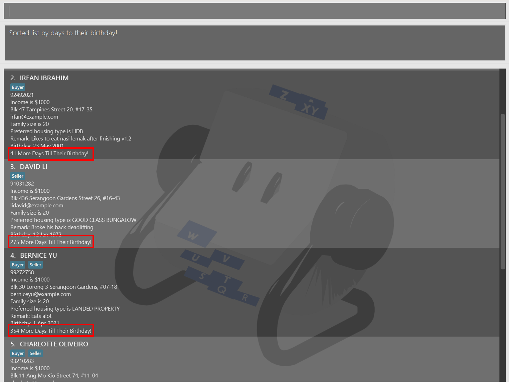
</div>

--------------------------------------------------------------------------------------------------------------------

<div style="page-break-after: always;"></div>


### Clearing Realodex : `clearRealodex`

Clears all clients in Realodex.

**Format:**
<box>clearRealodex</box>

<box type="tip">A longer command, <code>clearRealodex</code>
is used so that users understand that this command <b>clears all entries in Realodex</b>,
preventing potential confusion with the delete command and accidental clearing of all entries.
</box>

<box type="warning" header="Warning:">
Be careful with <code>clearRealodex</code>, you will be unable to undo this operation!
  </box>

**Example:**

* Upon `clearRealodex`, Realodex will clear and return an empty list.
<div style="display:flex; justify-content: center; align-items:center;">
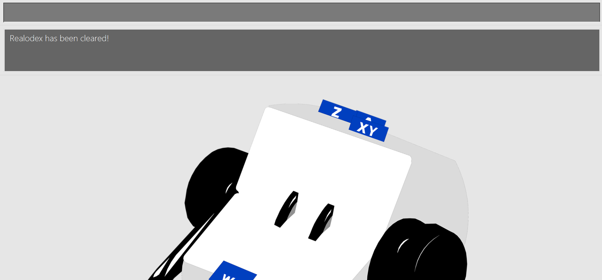
</div>

--------------------------------------------------------------------------------------------------------------------

<div style="page-break-after: always;"></div>

### Help : `help`

Generates a pop-up window, which is a summarized version of the User Guide and its features.
**Format:**
<box>help</box>


<box type="tip">This window can also be accessed by the "Help" button on the top menu.
</box>

**Example:**
* Upon `help`, Realodex will pop up a help window together with a success message.
<div style="display:flex; justify-content: center; align-items:center;">
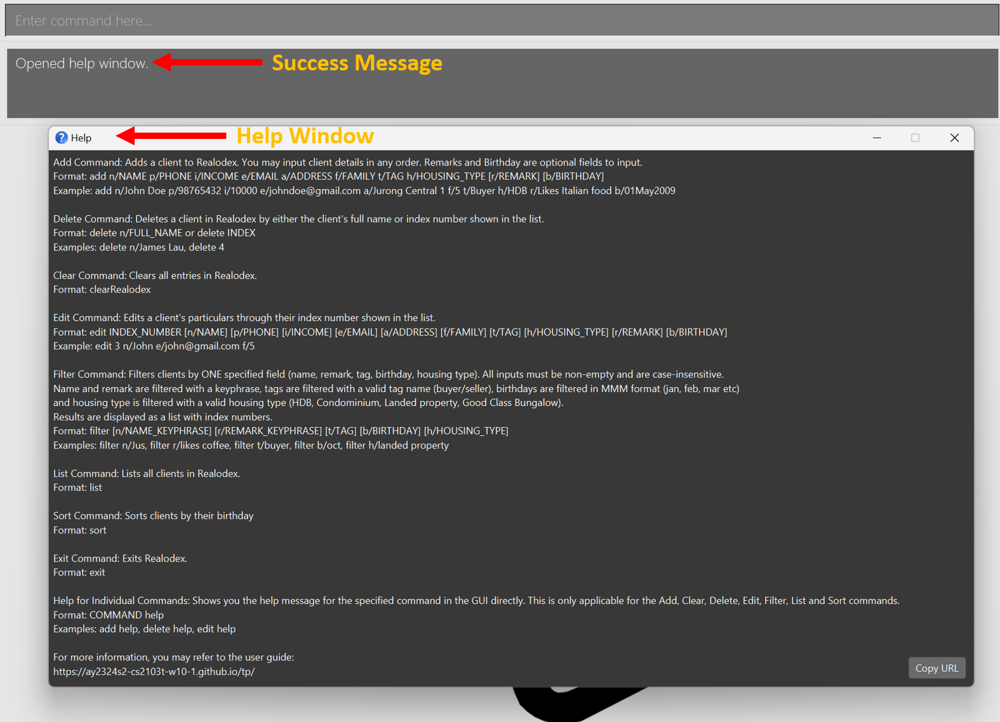
</div>

--------------------------------------------------------------------------------------------------------------------

<div style="page-break-after: always;"></div>

### Help (Individual Commands) : `COMMAND help`

Shows the help message for the specified command only.

**Format:**
<box>COMMAND help</box>

<box type="info" header="Things to note:">

* Note that this feature is only available for the `add`,`clearRealodex`,`delete`,`edit`,`filter`,`list` and `sort` commands.
* Although the format is `COMMAND help`, the exception is the help message for the clear command.
  Use `clear help` instead of `clearRealodex help`.
  </box>

**Example:**
1. User types in `add help`.
2. Realodex posts the help message for `add` command as shown below.
<p align="center">
      <a href="images/misc_features/command_help.png">
      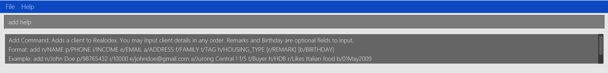
      </a>
</p>

--------------------------------------------------------------------------------------------------------------------

<div style="page-break-after: always;"></div>

### Exiting the program : `exit`

Exits the program and closes the window.

**Format:**
<box>exit</box>

<box type="info" header="Things to note:">

* Note that keying in `exit` followed by any random string, such as `exit wrelvwrvn` will also cause the app to exit.
  </box>

--------------------------------------------------------------------------------------------------------------------

<div style="page-break-after: always;"></div>

### File Data

The JSON file that stores the data of your contacts can be found in a folder named `data`, in the same folder/directory as the Realodex app. (e.g. if you
have Realodex installed in your Desktop, the `data` folder containing the file can be found in your Desktop as well.)

#### Saving Data

Realodex data is saved in the hard disk as a JSON file automatically after any command that modifies it. There is no need to save manually.

#### Editing Data

Realodex data is saved automatically as a JSON file `[JAR file location]/data/realodex.json`. Advanced users are welcome to update data directly by editing that data file.

<box type="warning" seamless>

**Caution:**
If your **manual changes to the data file makes its format invalid**, Realodex will **discard all data and start with an empty data file at the next run.**  Hence, it is recommended to make a backup of the file before editing it.<br>
Furthermore, certain edits can cause the Realodex to behave in unexpected ways (e.g., if a value entered is outside the acceptable range). Therefore, edit the data file only if you are confident that you can update it correctly.
 be found in the `data` folder, and restart the app. A new JSON file with sample contacts will be generated and you may proceed from there.
</box>

#### Restarting with New Data
Should you want to re-enter your contacts in a fresh JSON file in the event of file corruption or a bad edit causing the format to be incorrect,
simply delete `realodex.json`, which can be found in the data folder, and restart the app. A new JSON file with sample contacts will be generated and you may proceed from there.

--------------------------------------------------------------------------------------------------------------------

## Field Constraints
Summarized in the table below are the attributes of a client along with their constraints. These constraints are important and are used for the `add`, `edit`, `delete` and `filter` functions!

| Format          | Constraints                                                                                                                                       | Example                                                                                                  |
|-----------------|---------------------------------------------------------------------------------------------------------------------------------------------------|----------------------------------------------------------------------------------------------------------|
| `n/Name`        | Alphanumeric, unique, case-insensitive                                                                                                            | <ul><li>✅ <code>n/John Doe</code></li><li>✅ <code>n/JoJo Siwa 1</code></li><li>❌ <code>n/Han$el</code></li></ul> |
| `p/Phone`       | Only numbers, at least 3-digit long                                                                                                     | <ul><li>✅ <code>i/1234</code></li><li>❌ <code>i/123A</code></li></ul>                                    |
| `i/Income`      | Integer and should be at least 0.                                                                                                                 | <ul><li>✅ <code>i/10000</code></li><li>❌ <code>i/10,000</code></li><li>❌ <code>i/-1</code></li></ul>     |
| `e/Email`       | Format `local-part@domain`                                                                                                                        | <ul><li>✅ <code>e/admin@realodex</code></li><li>❌ <code>e/hello@gmail</code></li></ul>                   |
| `a/Address`     | No constraints                                                                                                                                    | <ul><li>✅ <code>a/6 College Avenue West</code></li>                                                      |
| `f/Family`      | Should be an integer greater than 1                                                                                                               | <ul><li>✅ <code>f/4</code></li><li>❌ <code>f/five</code></li></ul>                                       |
| `t/Tag`         | Only accept "buyer" or "seller" as the input                                                                                                      | <ul><li>✅ <code>t/buyer</code></li></ul>                                                                 |
| `h/HousingType` | Must be one of the following: "HDB", "CONDOMINIUM", "LANDED PROPERTY", "GOOD CLASS BUNGALOW" (case-insensitive). Only one housing type is allowed. | <ul><li>✅ <code>h/HDB</code></li></ul><ul><li>❌ <code>h/big house</code></li></ul>                       |
| `r/Remark`      | Can be empty if remark is not specified.                                                                                                          | <ul><li>✅ <code>r/Likes to eat cake</code></li></ul>                                                     |
| `b/Birthday`    | `ddMMMyyyy` format. Not in the future.<br/>Not earlier than year 1000                                                                             | <ul><li>✅ <code>b/23Apr1972</code></li></ul>                                                             |

--------------------------------------------------------------------------------------------------------------------
## Command summary

| Action                         | Format, Examples                                                                                                                                                                                                                                |
|--------------------------------|-------------------------------------------------------------------------------------------------------------------------------------------------------------------------------------------------------------------------------------------------|
| **Add**                        | `add n/NAME p/PHONE i/INCOME e/EMAIL a/ADDRESS f/FAMILY t/TAG h/HOUSINGTYPE [r/REMARK] [b/BIRTHDAY]` <br> e.g. `add n/John Doe p/98765432 i/20000 e/johnd@example.com a/311, Clementi Ave 2, #02-25 f/4 t/Buyer h/HDB r/Likes cats b/31Dec1982` |
| **Delete (by name)**           | `delete n/NAME`<br> e.g. `delete n/John`                                                                                                                                                                                                        |
| **Delete (by index)**          | `delete INDEX`<br> e.g. `delete 3`                                                                                                                                                                                                              |
| **Edit**                       | `edit INDEX [n/NAME] [p/PHONE] [i/INCOME] [e/EMAIL] [a/ADDRESS] [f/FAMILY] [t/TAG] [h/HOUSINGTYPE] [r/REMARK] [b/BIRTHDAY]` <br> e.g. `edit 2 n/Denzel i/100000`                                                                                |
| **Filter**                     | `filter [n/KEYPHRASE] [r/KEYPHRASE] [t/TAG] [b/MONTH] [h/HOUSING_TYPE]`<br> e.g. `filter n/David`,`filter b/Oct`                                                                                                                                |
| **List**                       | `list`                                                                                                                                                                                                                                          |
| **Sort**                       | `sort`                                                                                                                                                                                                                                          |
| **Help**                       | `help`                                                                                                                                                                                                                                          |
| **Help (individual commands)** | `COMMAND help`<br> e.g. `add help`,`edit help`                                                                                                                                                                                                  |
| **Clear**                      | `clearRealodex`                                                                                                                                                                                                                                 |
| **Exit**                       | `exit`                                                                                                                                                                                                                                          |


--------------------------------------------------------------------------------------------------------------------
## FAQ

**Q**: How do I transfer my data to another Computer?<br>
**A**: Install the app in the other computer and overwrite the empty JSON file it creates with the JSON file that contains all of your data.

--------------------------------------------------------------------------------------------------------------------
## Known issues

1. **When using multiple screens**, if you move the application to a secondary screen, and later switch to using only the primary screen, the GUI will open off-screen. The remedy is to delete the `preferences.json` file created by the application before running the application again.
--------------------------------------------------------------------------------------------------------------------
